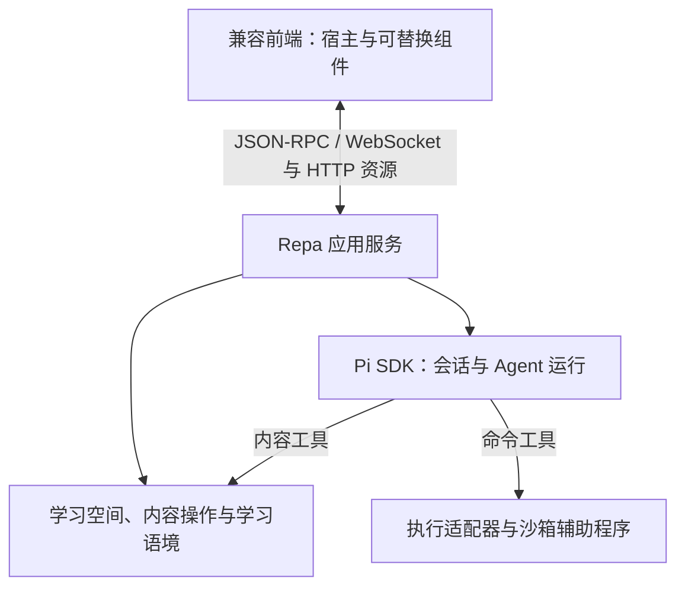

# Repa

Repa 是一个独立、本地优先的学习 Agent 应用。用户在自己的学习空间中保留材料、笔记、目标和反馈，与 Agent 持续推进学习。LLM 结合当前情境理解、解释和调整安排，程序承担内容操作、确定性检查和运行管理，减少重复交代背景与手工维护的负担。

Repa 的提示词、背景、工具和界面组件可以按需配置与组合，官方提供开箱即用的学习组合。

以下设计概览描述已经确定的产品行为与架构，供产品讨论、接口设计和开发协作使用。当前代码提供独立本机后端、公开应用协议、无 UI 客户端与 TUI；默认学习能力的完整组合仍属于目标设计。[实现范围与待验证选择](#设计记录与实现验证)说明两者的对应关系，现有代码的运行方式见[运行现有 TUI](#运行现有-tui)。

当前设计与调查依据的全部文件列在[设计文件清单](#设计文件清单)。建议先阅读本页总览，再查阅领域约定和相应的架构决策。

## 设计概览

### 职责总览

下表按当前产品范围整理十个功能职责块，用于判断接口、状态和行为的归属。职责块可以共处一个进程，包与目录按实现需要组织；一次实施可以同时涉及多个职责块。

| 编号 | 职责块 | 承担的范围 |
| --- | --- | --- |
| 1 | 学习空间与内容 | 空间身份与访问、文档和材料、内容组成、引用、修订、资源、基础查找、保存、撤回和外部变化处理 |
| 2 | 学习语境 | 语境的持久组成、展开与引用方式、当前视图及来源；会话适配层消费视图并保存实际提供的快照 |
| 3 | 会话与 Agent 运行 | 会话历史与分支、Pi 适配、模型与工具调用、流式消息、重试和压缩，以及语境快照进入模型输入的方式 |
| 4 | 应用协调 | 请求受理与结果查询、Agent 运行及独立后台处理的协调、待回答交互、多会话状态、取消、关闭与恢复的收尾 |
| 5 | 公开协议与客户端 | 可序列化的应用接口、schema 与版本协商、WebSocket 与 HTTP 接入、范围订阅，以及客户端的状态副本和重连 |
| 6 | 扩展与能力接入 | 包的发现、安装与启用、能力契约及兼容信息、共享能力入口；Agent 和前端组件分别通过相应宿主接入 |
| 7 | 运行配置与模型连接 | 命名的模型连接、凭据存取、应用与空间及会话设置的继承、实际运行配置和明确的回退策略 |
| 8 | 权限与执行环境 | 本机信任、授权作用域、命令执行及沙箱、生成内容的隔离与受控动作；实际隔离由对应执行环境落实 |
| 9 | 前端宿主与组件 | 官方界面、可替换组件的组合、草稿、导航与选区，以及内容展示和交互实例的前端状态；独立前端可直接使用第 5 项 |
| 10 | 默认学习能力 | 通过相同公开约定交付的学习协作、材料处理、整理、规划、练习和可视化等能力；具体能力与组合随学习需要扩展 |

第 6 项负责能力如何接入，第 10 项提供具体的学习行为。一个能力包可以同时提供 Agent 工具、后台操作和前端组件，并分别使用相应宿主。学习语境的视图由第 2 项生成，显示它的界面属于第 9 项。

持久化随状态归属组织：文档与资源历史属于第 1 项，会话历史属于第 3 项，请求记录属于第 4 项，连接配置属于第 7 项。SQLite、文件记录或对象存储是相应模块的实现选择。安装打包、平台适配、兼容迁移、诊断和测试验证覆盖上述职责，构成整体交付工作；其中格式兼容与迁移仍由拥有该格式的模块负责。

### 学习的起点与接续

已有目录和新目录都可以成为学习空间。未配置模型时，本地阅读和编辑能力仍然可用；使用 Agent 时，在 Repa 内配置模型连接。空空间可以从一个目标开始，Agent 根据实际交流补充背景、读取材料，逐渐形成文档和学习语境。

一项学习目标可以跨多个会话推进，一个会话也可以讨论多个目标。知识内容、学习目标与学习活动保留各自含义，文档粒度由实际内容决定。实际作答、对结果的解释和未来安排分别表达，判断可以随着新反馈修正。

### 默认学习能力

官方安装包附带可以直接开展学习的能力组合，默认体验由产品负责，各项能力通过相同公开接口接入并支持替换或关闭。

| 默认能力 | 提供的行为 |
| --- | --- |
| 材料查找与阅读 | 寻找来源、关联原件、定位阅读、提取必要内容并保留出处 |
| 讲解与讨论 | 解释概念、推导过程、比较理解方式，围绕当前问题继续交流 |
| 练习、实验与反馈 | 生成练习、运行代码或交互实验，检查结果并结合实际作答给出反馈 |
| 内容整理与接续 | 补充文档、建立引用、调整组织，维护后续需要的学习语境 |
| 学习规划 | 根据目标、进展和时间约束提出安排，随反馈调整 |
| 内容浏览与交互展示 | 浏览文件及其关系，使用图表、可操作页面和其他产物辅助学习 |

默认材料处理覆盖文本、Markdown、网页、PDF、图片和代码阅读，音视频转写等能力通过相同材料入口启用。需要额外服务或运行组件时，在使用该能力时说明接入条件。材料可以先关联并阅读相关部分，提取和索引按需进行。

默认启用的学习协作约定说明空间、语境、材料与长期内容的使用方式，方法说明按需取用；预置约定和自动背景可以通过[提示配置](docs/adr/0001-embed-pi-through-node-sdk.md#提示内容与自动注入)修改或关闭。默认学习组合中的教学判断由模型结合当前目标与反馈形成，可以直接给出解释或完整帮助，也可以通过练习继续了解困难；稳定的时间计算、约束检查和文件处理由工具承担。

Agent 主动维护值得跨会话保留的信息，实际交流留在会话，持续维护的解释、计划与问题进入文档，当前所需背景通过学习语境提供。产物完成、实际作答与掌握判断保留各自含义：Agent 生成的代码通过测试，并不直接证明学习者已独立掌握；判断依据后续解释、尝试与反馈修正。

学习空间的可视化保留美观、动效和探索价值，可以采用树、关系图或其他布局。布局与表现由能力决定，内容身份、引用和必要资源由学习空间维护；普通链接、分类与先修关系按实际含义呈现。交互实验可以与代码、数据和说明共同组成持续维护的内容。

### 学习空间与内容

长期内容属于学习空间，生命周期独立于会话。一份文档可以由单个文件或具有明确组成关系的多个文件承载，包括笔记、代码、交互产物及按学习需要组合出的其他形式。内容保存在实际文件中，主要在 Repa 内编辑，也兼容外部编辑。新建文本类文档默认采用 Markdown，读者可以是用户、Agent 或两者。

内容整体与成员按实际引用和编辑需求取得身份，内部文件可以独立读取与局部修改。持续维护的产物保留必要源内容、数据与资源，组成和资源保留关系随内容保存；引用外部材料继续遵循来源关联的语义。

来源材料先建立关联，提取、转写和索引按需进行。空间外材料默认引用原文件；将同一材料收进空间时保留身份，改为读取空间内副本并保留来源说明。更新同一材料保留身份，加入另一材料或独立复制建立新身份。原件不可用或关联移除时，相关笔记、校订稿和批注继续存在。

Repa 的内容引用通过稳定身份在所属空间内解析，移动和改名保持身份，普通路径链接继续遵循路径语义。引用通常读取当前内容，定位信息和引用时所见修订用于按需核对；固定历史原件需要显式副本或版本记录。外部 Markdown 编辑器可以编辑正文，跳转 Repa 引用需要相应支持。

空间默认在 `.repa/` 中保存内容清单、Session、空间设置及缓存。内容清单记录身份、角色和位置，属于持久数据；搜索索引和可重建的提取结果属于缓存。搬移或恢复空间保持空间身份，独立复制建立独立的空间身份并保留副本内的引用关系。完整备份包含希望保留的历史，应用侧模型连接和凭据分别管理；外部原件作为依赖检查和重新关联，也可以显式收进空间。

### 保存、撤回与恢复

前端和 Agent 工具共用内容操作。日常局部修改根据当前文本或选区定位，保留其他内容并返回实际 diff；匹配失败或含糊时提供相关片段，供补读和重试。整篇覆盖、保存较早打开的文档和需要绑定版本的结构操作使用修改基准（`base`）。

官方编辑器默认自动保存，完成写入后才报告已保存。一次 Agent 请求可以产生多次内容操作，必须共同完成的正文、身份与引用变化才协调为同一项操作。取消 Agent 保留已完成的修改，进行中的内容操作按恢复规则收尾。

保存不自动启动 Agent 或将普通文件全文加入上下文。普通文件可由 Agent 自行读取，也可按所选策略提供变化提示或合并差异；启用自动注入的学习语境继续在新运行入口按当前视图处理。

历史、撤回和中断恢复共用变更记录。撤回作为新操作保留能够区分的后续修改，重叠或含糊时保留当前内容并报告冲突。跨文件操作先准备恢复记录，再应用修改并确认完成；失败或重启后依据实际状态恢复。外部文件访问者不参与相同的提交协调，外部编辑的历史限于实际观察到的版本。

恢复冲突时，实际文件仍可查看、比较和修复；依赖未确认身份、位置或组成的查询与修改返回待恢复信息，已确认无关的正常使用继续。内容模块核对并保存修复结果后解除相应状态，原中断事实保留。诊断可使用选定输入与既有独立模型处理能力，不要求先完整展开出现问题的学习语境。

### 学习语境与会话

学习语境可以直接关联一份文档，也可以通过有序组成清单关联多份内容，保留顺序和必要分组。

| 成员方式 | 提供给模型的内容 |
| --- | --- |
| 展开 | 所选文档的当前正文或明确选择的模型可读表示 |
| 引用 | 标题、内容引用和可选说明，由 Agent 按需读取 |

普通链接按引用保留，组成清单只展开明确选择的成员或表示，多文件内容的全部文件及依赖资源不会自动展开。正文通过共同内容操作维护，成员关系由语境模块调整，前端可以查看当前生成的视图及来源。

启用学习语境自动注入时，每次新运行开始处理请求都取得当前语境，与有效模型输入中最近的完整快照比较，变化或缺失时追加新的语境消息，保持此前输入前缀稳定。同一运行的内部步骤和 steer 沿用入口背景，工具仍可读取当前内容；Pi 压缩后从既有记录补回所需背景，继续同一次运行。关闭自动注入保留文档与绑定，停止主动提供及补回该输入源；清空语境则是明确更新，读取失败报告错误并保留请求。会话快照记录过去提供的背景，空间内容持有当前语境。实际缓存收益依据 provider 的用量与延迟判断。

token 估算、用量统计、压缩触发和有限溢出恢复复用 Pi，不新增计数或预算机制；Repa 只核对自身注入及补回内容在接入流程中是否得到覆盖。仍超限时明确结束失败尝试，保留请求和已完成结果，通过调整已有展开与引用或模型选择后继续，不静默截断完整背景。

新建会话开始新的交流历史，恢复会话接续旧历史，分支从选定位置展开讨论；这些操作继续使用空间中的当前内容。需要两套内容独立演变时显式复制内容或空间。临时讨论留在会话，长期信息在实际工作中维护到文档和语境，关闭会话不要求全量总结。

### 会话输入与接续

同一会话由一个活动运行推进历史，多个会话可以并行。普通发送在运行中用于补充当前工作，明确选择“做完后处理”则提交独立后续请求。

| 操作 | 行为与归属 |
| --- | --- |
| 会话空闲时发送 | 开始新运行 |
| 运行中普通发送 | 作为 steer 进入指定的当前运行，沿用其配置与入口背景 |
| 明确选择后续处理 | 后端接收并排队，作为独立后续运行开始 |
| 继续失败任务 | 在其所属会话的当前历史上，提交明确接续旧任务的新请求；忙时排队 |

输入接收状态与运行完成分别表达。steer 的目标已经结束或不匹配时，保留输入并返回未接入结果，不将其悄悄交给其他运行；失败后继续也不自动建立新会话或返回旧分支。具体约定见[会话输入与接续](docs/adr/0004-connect-replaceable-frontends-through-application-protocol.md#会话输入与接续)。

### 后端与可替换前端

前端整体可以替换，前端内部的组件也可按公开约定替换和组合。官方与第三方前端使用相同应用接口，Pi 的对象和生命周期集中在内部适配层。



公开调用采用 JSON-RPC 2.0，默认通过 WebSocket 传输，资源读取使用 HTTP，两条入口都执行访问控制。订阅提供当前快照及其后的变化，重连从有效游标继续，无法继续时重新取得快照。请求受理与最终执行结果分别表达，业务请求标识用于查询状态和识别重复提交。

目标请求接口同时表达文本、草稿选区、内容引用和图片等资源，保留其来源与实际提交的内容。选区使用发送时的草稿，不以磁盘上的旧内容代替；内容引用继续表达目标引用，实际读取或提供给模型的表示记录其来源与修订。本次输入、材料关联和加入学习语境分别操作，附件不自动成为长期背景。请求和会话保留各自继续与重开所需的输入资源。

前端组件通过开放的角色登记约定接入，内容导航、消息区、输入区、编辑器、展示器和辅助面板等是官方默认集合，后续可以扩展新角色。新增内容格式也可以沿用已有角色。宿主持有跨组件工作状态，同一工作台的编辑器共用相应内容的草稿，保存回执保留等待期间的新输入；未保存的选区作为草稿来源提供给 Agent。组件通过数据绑定订阅当前状态及变化，正常关闭清理其界面资源，已提交的后端操作保持自身生命周期。

官方前端在宿主启动时确定可用的组件实现及代码版本，实例按明确选择、配置中的默认实现和基础回退方式装配；在已有集合中打开不同展示方式属于普通使用。安装、升级或更换组件代码后重启前端宿主生效，组件内部框架由实际实现选择。应用协议、组件宿主和扩展能力分别声明兼容范围，公开数据结构以可分发的 schema 为准，客户端类型与运行时校验从同一来源生成。

### 扩展、展示与执行

安装包附带可直接使用的官方组件、基础工具和学习协作约定，采用公开接口并支持替换或关闭。包来源与安装优先复用 Pi 的机制，Repa 按宿主分别装配各部分。一个包可以选择提供 Pi Agent 资源、共享后台能力和前端组件，或组合其中多种部分；原有 Pi 声明继续使用。共享后台能力接受本次调用的输入与空间等上下文，模型工具和前端按各自形式调用同一处理逻辑。前端入口与兼容信息由相应宿主约定，插件交付与配置选择可以配合使用。

共享能力按需要使用模型调用、读取历史或推进指定会话。对明确输入进行模型处理可以独立于学习会话执行：从 Agent 工具调用时归入当前工作，从前端直接调用时归入相应后台请求，复用已有取消与结果语义。

Repa 提供内容读写、引用与组成、数据和资源传递、动作调用、状态观察与结果保存等可组合原语。能力通过公开契约表达输入、输出和操作，Agent 可以组合能力并产生新的内容形式，同一份内容可以具有多种阅读、展示、运行与交互方式。

应用持有授权，能力入口检查实际操作与目标范围，执行环境落实限制。默认在当前空间的授权内阅读与编辑学习内容，明确加入的外部材料允许读取原件；应用管理状态由所属模块维护。命令使用当前空间的执行策略，新增空间外写入或扩大网络访问范围时请求所需授权。权限请求绑定具体操作与范围，复用现有待回答交互；已有授权覆盖的调用直接执行，组件角色与内容声明不自行授予权限。

插件提供展示能力，生成的各类产物作为内容进入相应渲染器。需要脚本的内容默认在独立展示环境中执行，按实例取得数据、资源和动作。缩放、调参和动画留在展示内部，保存结果、提交练习、调用工具或请求 Agent 由宿主按授权处理。内容数据和声明保留来源，不自行成为用户指令或授权。需要保留的运行与交互结果关联实际使用的内容修订与输入，后续编辑源内容不改写已有结果。

活跃展示由宿主临时持有实际使用的受管理内容版本与资源，清理历史不打断仍有效的实例。保存为文档或提交后台处理时，建立相应的独立资源保留关系，展示仍在使用的资源继续临时持有；相同字节仍可共用，外部原件不因此自动形成历史副本。

用户可以显式选择 Full Access 放宽相应范围的执行或展示权限，宿主说明作用范围。重新打开历史产物按当前授权建立实例，旧声明不恢复失效权限。会话保存重开展示所需的内容与输入数据，长期文档保留其必需资源，生命周期独立于原会话清理。无法满足所需执行条件的前端提供静态结果或源码视图。

沙箱执行层优先复用 [Codex 的开源沙箱模块](https://github.com/openai/codex/tree/3d2ee51ca2d5db578f328aa75e20aa22c0197c9a/codex-rs/sandboxing)，由 Repa 自行集成、配置和交付。正常使用 Repa 不要求另行安装、登录或配置其他 Agent 应用。同宿主加载的插件代码仍按其运行环境的信任边界管理，命令沙箱不自动隔离全部插件代码。

执行适配器报告实际支持的限制，不能满足条件时明确返回原因。后续操作检查当前授权，收回正在使用的权限须由相应环境停止或解除执行能力；已完成结果继续保留。命令可能在部分完成后才遇到权限拒绝，新增授权不自动触发整条命令重跑。具体责任见[权限与执行环境的决策](docs/adr/0005-execute-display-content-with-host-permissions.md)。

### 配置与运行生命周期

模型连接可使用 API key、本地服务或 provider 实际支持的登录方式。连接拥有独立身份并可以命名，模型选择同时指定连接及其中的模型，空间、会话和需要模型的能力保存必要引用。搬移空间后找不到连接时提示重新绑定或显式恢复继承，不仅凭同名接入其他服务。凭据由应用侧管理，普通配置查询、会话历史和学习语境不承载凭据明文。

| 作用域 | 主要配置 |
| --- | --- |
| 应用 | 模型连接、默认运行设置、已安装能力、本机信任与授权 |
| 学习空间 | 材料、语境、能力约定及允许覆盖的运行设置 |
| 会话 | 当前选择的模型与运行选项 |
| 前端 | 布局、主题、快捷键和草稿等交互状态 |

可继承设置由后端按应用默认、空间设置和会话选择解析，查询提供当前覆盖、有效值与来源。恢复继承删除对应覆盖，显式无效设置指出原因。后端按项处理修改，插件在自己的命名空间声明设置、允许作用域和校验规则，禁用后保留已有设置。

启动独立运行的请求（含排队请求）在受理时绑定连接、模型与运行选项，steer 沿用目标运行配置；同一提交的重传保留原归属与选择。后续默认设置变更不改写已经提交的选择，排队请求开始时才取得当前学习语境。代码版本在相关宿主重启后切换，凭据续期服务同一认证身份，账号或端点变更不在运行中途改写连接；授权仍按当前状态检查。

模型连接失败时保留请求、历史和已完成工作。选择继续时，提交明确指向旧任务的新请求，在该任务所属会话的当前历史上接续；忙时排队。原输入尚未进入历史时从受理记录补入一次，已经进入时不重复追加；后端不自动回放已完成工具，Agent 根据实际结果与当前内容决定后续操作。自动更换模型须有已配置的回退策略，记录实际选择，不静默丢弃输入。具体配置与认证责任见 [Pi 嵌入决策](docs/adr/0001-embed-pi-through-node-sdk.md)。

前端切换会话只改变查看对象，查看历史不启动 Agent。当前运行正常结束后自动开始该会话可自动执行队列中的下一条请求；取消或失败终态使所属会话的未执行队列暂停并保留供明确继续，取消单条排队请求不影响当前运行，其他会话按自身状态继续。

官方前端正常关闭最后一个窗口时，继续已启动工作及可自动执行的已提交队列；等待回答或授权时后端保持运行，重新打开可以接回。暂停队列持久保留，在没有其他运行中工作、可自动开始的请求、未决交互及前端时可退出。完整退出停止当前工作并保留未执行项，重开后由明确操作继续。官方前端宿主接入本机通知，通知不可用不影响状态保留与查询；关闭前提交能正常保存的编辑，其余草稿保留为本地恢复状态。

异常中断后恢复实际状态，结果不明的操作先核对再决定如何继续。定时复习、定期整理等主动后台能力由单独启用的扩展提供，完成已明确提交的工作不自动启用新的后台任务。

需要跨界面存活的材料提取、转写等处理可以独立于 Agent 会话提交，沿用应用协调层的受理、进度、结果查询、取消与关闭语义。处理能力拥有输入转换及结果含义，内容模块拥有保存的结果与资源；关闭展示实例不自动取消已经受理的处理。

### 连续使用与恢复

下表从连续操作说明目标行为及其主要责任，作为接口实现和集成验证的依据。

| 连续操作 | 状态如何衔接 |
| --- | --- |
| 提交草稿选区或附件后断线 | 后端保留接收状态与归属，前端查询原提交，未提交草稿由前端恢复 |
| 运行中补充输入或另交后续任务 | steer 归当前运行，显式后续请求排队；取消或失败后保留未执行项供明确继续 |
| Agent 修改期间继续编辑并保存 | 共同内容操作检查修改条件，保存回执只确认所提交的版本，保留之后的新输入 |
| 更新语境、压缩会话、再处理后续请求 | 当前运行及 steer 沿用入口背景，压缩从实际记录补回；后续运行开始时取得当前语境 |
| 会话已推进后继续旧任务 | 新请求明确接续对象，在所属会话的当前历史上继续，原失败与已有结果保留 |
| 将会话产物保存为文档，或建立会话分支 | 文档与分支分别保留自身需要的资源，清理原会话不破坏这些内容 |
| 展示 V1 期间保存 V2 并清理旧历史 | 仍有效的旧实例临时持有 V1 的受管理输入与资源，使用结束后才允许回收 |
| 处理材料期间关闭并重开前端 | 后台处理按既定生命周期继续，重新连接可以查询进度与结果 |
| 搬移空间或建立独立副本 | 搬移保持身份，独立副本建立独立身份；内部引用保留，外部材料与模型连接按实际状态重新关联 |
| 运行期间修改配置、升级插件或收回权限 | 配置不改写已受理选择，代码版本在相关宿主重启时切换，当前授权由实际执行环境落实 |

### 设计文件清单

当前产品与架构设计保存在 7 份文件中，另有 1 份技术调查提供事实依据，完整清单如下。新增或调整设计文档时同步更新此表。

| 文件 | 内容与责任 |
| --- | --- |
| [README.md](README.md) | 产品总览、默认学习能力、十块职责、连续操作与恢复、当前实现范围及运行入口 |
| [CONTEXT.md](CONTEXT.md) | 已确认的领域概念、关系与不变量，持有产品语义 |
| [docs/adr/0001-embed-pi-through-node-sdk.md](docs/adr/0001-embed-pi-through-node-sdk.md) | Pi 与应用的责任、模型连接与凭据、配置继承、可控提示与注入、失败接续和默认能力 |
| [docs/adr/0002-progressively-load-learning-context.md](docs/adr/0002-progressively-load-learning-context.md) | 学习语境的组成与读取、请求快照、缓存前缀、压缩恢复和准备失败 |
| [docs/adr/0003-share-file-based-content-operations.md](docs/adr/0003-share-file-based-content-operations.md) | 文件正文、材料与资源、空间身份、内容引用、共同操作、保存、撤回及外部变化 |
| [docs/adr/0004-connect-replaceable-frontends-through-application-protocol.md](docs/adr/0004-connect-replaceable-frontends-through-application-protocol.md) | 公开能力与请求输入、steer 与排队接续、前端状态、任务生命周期、组件宿主和扩展兼容 |
| [docs/adr/0005-execute-display-content-with-host-permissions.md](docs/adr/0005-execute-display-content-with-host-permissions.md) | 调用授权、命令执行、展示实例与活跃资源、权限变更和历史产物 |
| [docs/research/pi-ecosystem-compatibility.md](docs/research/pi-ecosystem-compatibility.md) | Pi 生态、公开复用入口、提示装配与固定版本核验，以及 Codex 编辑行为对比；结论按文中调查基准解释 |

具体接口集中记录在 [Repa v1 接口草案 #16](https://github.com/Utopia-V/repa/issues/16)，覆盖前后端协议、共享后台能力与组件宿主。该议题持有待实现的接口方案，当前可运行代码仍按下方的实现范围说明。

[docs/development/](docs/development/README.md) 组织已实现模块的开发说明，包括内容与恢复、Agent 接入及验证入口，随代码更新。

[AGENTS.md](AGENTS.md) 和 [.agents/skills/](.agents/skills/) 保存项目协作约束与工程方法；`test/fixtures/` 中的 Markdown 是测试材料。产品决定由上表中的领域约定和架构决策持有，调查记录用于追溯技术依据。

通用 Agent 行为的开发参照包括 Codex 的公开文档、源码与相邻测试，具体使用约定见 [AGENTS.md](AGENTS.md)。影响 Repa 行为的取舍及核验版本记录在相应 ADR。

### 设计记录与实现验证

结构恢复与语境容量已按相应 ADR 的当前方案确定，保留两项实践观察标记：

- [恢复冲突的保护范围与修复体验](docs/adr/0003-share-file-based-content-operations.md#恢复撤回与外部变化)：是否不必要地限制无关操作，是否能用现有能力完成修复。
- [完整语境补回与 Pi 计量、压缩的实际配合](docs/adr/0002-progressively-load-learning-context.md#容量处理与实践观察)：长期使用中是否出现频繁超限、过多压缩或反复手工维护背景。

这些标记用于实现验证和日后实际使用反馈，出现具体问题后再调整相应策略。

设计范围为单机本地使用，多端同步留待后续。文档中的默认行为和职责约定属于目标设计，当前实现范围如下。

| 范围 | 当前代码与后续接入 |
| --- | --- |
| 应用协议、客户端与 TUI | 已有本机后端、协议 v1、无 UI 客户端、多空间多会话、订阅重连和运行记录；请求输入当前仅支持文本，steer、排队及指定旧任务接续尚未接入 |
| 内容与学习语境 | 已接通文件读写、精确修改、多文件补丁、内容身份与组成、操作查询、撤回与恢复、外部材料只读关联、不可变资源和学习语境注入；检索、独立复制与材料收集、资源清理及活跃使用管理待接入 |
| 扩展与配置 | 已有明确信任后的 Pi 扩展加载、应用／空间／会话提示继承和实际提示装配；共享后台能力入口、独立模型连接管理、辅助调用提示配置与官方默认能力组合待接入 |
| 前端与执行环境 | 图形组件宿主、多种请求输入、生成内容展示隔离及命令沙箱待实现 |

当前模块责任、调用示例、持久格式和验证入口见[开发指南](docs/development/README.md)。已经实现的字段由公开 schema 持有；后续仍需落实包入口元数据及官方图形前端的宿主和内部框架。Web 组件接入形状是参考契约，Electron、React 均未被确定为必须依赖。

集成验证需覆盖上述连续操作，以及沙箱辅助程序的独立构建与平台接入、可执行展示的真实隔离边界。现有运行验证范围为 Linux，模型调用使用确定性 faux provider；接口调查与局部试验不替代平台和真实学习体验验证。安装体积、启动速度和运行开销由实现测量，结构上的职责共用不作为性能结论。

## 运行现有 TUI

需要 Node.js 22.19.0 或更高版本。依赖由 `package-lock.json` 固定。

```sh
npm ci --ignore-scripts
npm run check
npm test
npm run build
```

测试通过本地 WebSocket、HTTP、真实 Pi SDK 和独立 Node 进程检查运行行为；模型调用使用确定性 faux provider，认证与学习空间使用临时目录。当前端到端验证覆盖 Linux，其他系统的进程启动、文件锁与退出行为仍需验证。

### 配置模型

当前版本复用 Pi 的模型和认证配置；目标应用的模型连接界面与独立凭据管理见设计概览。可以运行仓库锁定版本的 Pi，使用 `/login` 配置认证，并使用 `/model` 选择默认模型：

```sh
npm exec -- pi
```

后端读取 Pi 标准 agent 目录中的配置，也可通过 `--agent-dir <目录>` 指定配置目录。相应 provider 支持的 API key 环境变量仍可使用。查看和新建会话不启动 Pi 运行实例；发起任务时才加载运行资源。缺少可用模型时，任务保留请求并返回可处理的配置错误。

### 启动与接续

将示例路径替换为实际学习空间目录：

```sh
npm start -- /path/to/learning-space
# 构建后也可直接运行
node dist/cli.js /path/to/learning-space
```

TUI 自动连接或启动独立的本机后端，打印连接文件的位置。同一系统用户的后续普通启动使用该后端，可以同时查看不同空间或会话。默认选择空间中最近活动的会话；`--new-session` 新建一段交流。

| 命令 | 行为 |
| --- | --- |
| `/cancel` | 请求取消当前会话的任务，最终结果在实际停止后更新。 |
| `/new` | 新建并查看会话，其他会话的任务继续运行。 |
| `/sessions`、`/use <会话ID>` | 列出会话摘要，或切换查看对象。 |
| `/branch <消息ID>` | 从已保存的消息建立新会话，保留原会话及其运行；未配对的工具调用不能作为分支终点。 |
| `/status <请求ID>` | 查询原请求的受理与执行状态。 |
| `/exit` | 关闭当前前端；最后一个前端离开后，后端完成已启动任务再退出，有待回答交互时继续运行并等待重连答复。 |
| `/quit` | 完整退出后端，停止任务并保留已有历史及执行结果。 |

生成期间按 `Ctrl+C` 请求取消，空闲时按 `Ctrl+C` 关闭当前前端。扩展需要回答时，TUI 显示问题并接收回答；确认题使用 `yes` 或 `no`，选择题可以输入选项编号，`/dismiss` 取消该交互。所有前端离开后，待回答的交互仍由后端保留；重新连接可以继续。

会话 JSONL 保存在 `<space>/.repa/sessions/`。空间身份与任务记录位于 `.repa/runtime/`，内容身份、操作恢复记录与不可变资源位于 `.repa/content/`，空间和会话提示覆盖位于 `.repa/settings.json`。备份时应连同正文保留这些持久数据，具体责任见[内容、保存与恢复](docs/development/content.md)。

运行日志采用独立的 `repa.run` 格式，当前磁盘格式版本为 `1`，记录请求事实与可选终态；运行进度由后端状态持有。旧版无版本记录继续按原格式读取，新记录使用当前格式追加，已有有效记录保持原样。遇到不支持的格式版本或完整的损坏记录时，停止恢复并保留原文件；只有尚未完成的末尾追加可以在完整记录校验后清除。

运行锁由 `proper-lockfile` 管理并在正常退出时释放；强制终止后，旧锁需要经过约十秒的失效期才能重新取得。恢复后的未完成任务标记为 `interrupted`，供核对结果，不自动重新执行。

### 独立后端与其他前端

可以显式启动后端，再让多个前端通过连接文件接入：

```sh
npm start -- serve --connection-file /path/to/repa-connection.json
npm start -- /path/to/learning-space --connect /path/to/repa-connection.json
```

独立启动的后端默认保持运行；加入 `--exit-when-detached` 后，最后一个前端离开时等待已启动任务及其交互完成，再收尾退出。端口默认由系统分配，`--port` 可以指定端口。监听地址为本机 `127.0.0.1`，连接文件包含地址与访问令牌，按仅当前用户可读写的权限创建。默认启动的连接文件和诊断日志位于系统运行时目录；它们不进入学习空间。

### Package 与 Extension 信任

后端默认不加载 Pi Package、Extension、Skill 或 prompt。通过 `--trust-extensions` 显式启用 Pi 全局资源和空间中的项目资源：

```sh
npm start -- /path/to/learning-space --trust-extensions
# 或为独立后端启用
npm start -- serve --connection-file /path/to/repa-connection.json --trust-extensions
```

信任配置属于后端进程。若已有后端未启用扩展信任，可以完整退出后重新启动，或使用独立连接文件启动另一后端。启用的插件代码以宿主进程权限运行；当前命令沙箱尚未接入。

当前提供 `read`、`edit`、`write`、`apply_patch` 内容工具，前端和 Agent 共用保存与恢复逻辑；读取也支持已启用 Skill 的自有资源。命令工具和沙箱尚未接入。兼容的扩展工具、prompt 与 Skill 可以使用；扩展的选择、确认、输入和编辑器交互通过后端转为待回答问题。依赖 Pi 专用 TUI 组件的扩展需要前端适配。

### 公开应用接口

[协议 schema](src/protocol.ts)同时持有方法参数、返回值、消息和订阅数据结构，TypeScript 类型从同一来源推导，后端与客户端均执行校验。协议版本为 `1`；连接时通过 `initialize` 提交令牌和支持的版本。公开调用采用 JSON-RPC 2.0，经 `/rpc` WebSocket 传输，Repa 操作使用带 `id` 的请求。

应用协议版本与磁盘格式版本分别管理；影响既有调用方的不兼容协议修改需要增加协议版本，并同步更新 schema 与客户端。前端联调按共同选定的提交及其 schema 开展，具体组件宿主约定仍按 ADR 0004 接入。

| 方法 | 责任 |
| --- | --- |
| `space.open`、`space.list` | 打开本地空间并取得稳定身份，或列出后端已打开的空间。 |
| `session.create`、`session.list`、`session.get`、`session.branch`、`session.close` | 创建、列举摘要、读取历史、建立分支和释放运行实例；查看历史不启动 Agent。 |
| `run.submit`、`run.get`、`run.cancel` | 受理请求、查询结果和请求取消。 |
| `content.*`、`operation.*` | 读取和保存文件，维护身份与组成，查询、撤回及核对恢复结果；具体方法见[内容接口](docs/development/content.md)。 |
| `context.get`、`context.set`、`context.preview` | 读取或更换学习语境绑定，并预览当前完整文本和来源。 |
| `settings.get`、`settings.set`、`settings.reset` | 读取提示覆盖与来源，按项保存或恢复继承。 |
| `interaction.reply` | 回答仍有效的交互；已经回答、取消或过期的交互不能再次使用。 |
| `state.get`、`subscription.start`、`subscription.stop` | 按应用、空间或会话范围读取快照和订阅变化。 |
| `client.detach`、`shutdown` | 离开后端，或请求完成现有任务后退出、取消任务后退出。 |

`run.submit` 使用调用方生成的 `requestId`，它与 JSON-RPC 应答配对用的 `id` 含义不同。同一空间内重复提交相同请求只返回既有状态；复用标识提交不同内容会得到冲突。`accepted` 表示受理记录已保存，终态在 Pi 完整收尾后产生。`run.get` 找不到记录时明确返回 `unknown`。

订阅先提供快照，再提供变化。客户端重连时携带原游标，后端缓存仍可接续时重放遗漏变化，否则发送新快照。客户端维护本地状态副本；连接丢失或应答超时的操作不会自动重发，调用方通过请求标识核对结果。查询得到的会话列表按最近活动排序，只包含摘要；完整消息通过 `session.get` 或相应范围的状态订阅取得。

[无 UI 客户端](src/client.ts)使用标准 WebSocket、Fetch 和 Web Crypto，可供 Node 程序和浏览器前端使用。构建后的包提供独立的 `repa/client` 与 `repa/protocol` 入口；浏览器通过构建工具引入客户端，无须包含后端或 Pi。

```typescript
import { readFile } from "node:fs/promises";
import { RepaClient } from "repa/client";

const connection = JSON.parse(
  await readFile("/path/to/repa-connection.json", "utf8"),
);
const client = await RepaClient.connect(connection);
const space = await client.call("space.open", { path: "/path/to/learning-space" });
const session = await client.call("session.create", { spaceId: space.id });
const watch = await client.watch(
  { spaceId: space.id, sessionId: session.sessionId },
  (snapshot) => console.log(snapshot.sessions[0]?.runs.at(-1)),
);

const requestId = crypto.randomUUID();
const receipt = await client.call("run.submit", {
  spaceId: space.id,
  sessionId: session.sessionId,
  requestId,
  text: "解释虚拟内存",
});
console.log(receipt); // 受理结果；最终执行状态由订阅或 run.get 取得。

// 界面关闭时调用。已受理任务由后端继续管理。
await watch.stop();
await client.close();
```

消息保留文本、思考、工具调用、资源与扩展数据结构。流式消息通过 `replaces` 与保存后的历史消息身份衔接。会话消息资源从 HTTP `/resources/<id>` 获取，空间不可变资源从 `/spaces/<spaceId>/resources/<id>` 获取，schema 从 `/protocol.json` 获取，均使用 `Authorization: Bearer <token>`。客户端的 `resource(id 或 ResourceRef)`、`uploadResource` 和 `readText` 处理认证与完整内容读取。具体的交互页面渲染与执行权限按 ADR 0005 后续接入。

GitHub Issue [#5](https://github.com/Utopia-V/repa/issues/5) 是产品主议题，当前设计语义与工程取舍见上面的项目文档。[#6](https://github.com/Utopia-V/repa/issues/6) 记录学习语境与通用工具接入，[#7](https://github.com/Utopia-V/repa/issues/7)、[#8](https://github.com/Utopia-V/repa/issues/8)、[#9](https://github.com/Utopia-V/repa/issues/9) 分别保留可视化、规划与知识整理的扩展想法；[#4](https://github.com/Utopia-V/repa/issues/4) 描述已有对话实现，早期规格 [#3](https://github.com/Utopia-V/repa/issues/3) 已退役。
