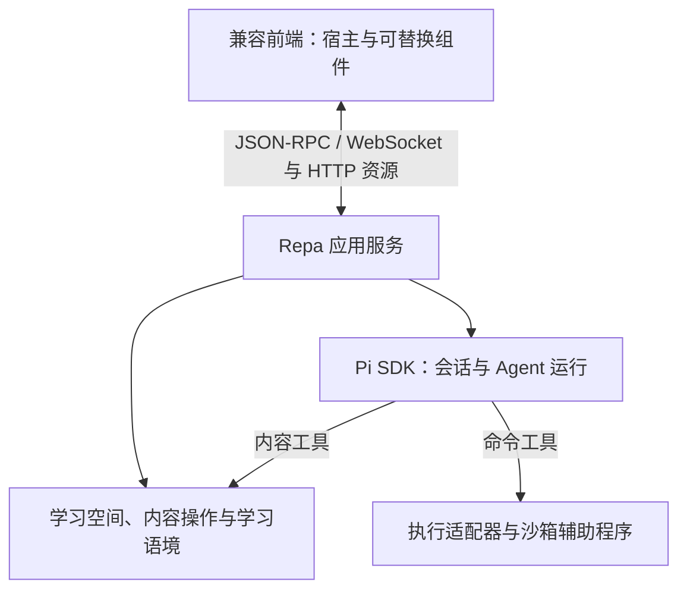

# Repa

Repa 是一个独立、本地优先的学习 Agent 应用。用户在自己的学习空间中保留材料、笔记、目标和反馈，与 Agent 持续推进学习。LLM 结合当前情境理解、解释和调整安排，程序承担内容操作、确定性检查和运行管理，减少重复交代背景与手工维护的负担。

以下设计概览描述已经确定的产品行为与架构。当前代码提供独立本机后端、公开应用协议、无 UI 客户端与 TUI，支持多会话、共享观察、断线恢复和明确信任后的兼容 Pi 扩展加载；图形组件宿主、共同内容操作、学习语境注入与执行沙箱仍待实现。现有代码的运行方式见[运行现有 TUI](#运行现有-tui)。

## 设计概览

### 学习的起点与接续

已有目录和新目录都可以成为学习空间。未配置模型时，本地阅读和编辑能力仍然可用；使用 Agent 时，在 Repa 内配置模型连接。空空间可以从一个目标开始，Agent 根据实际交流补充背景、读取材料，逐渐形成文档和学习语境。

一项学习目标可以跨多个会话推进，一个会话也可以讨论多个目标。知识内容、学习目标与学习活动保留各自含义，文档粒度由实际内容决定。实际作答、对结果的解释和未来安排分别表达，判断可以随着新反馈修正。

### 学习空间与内容

长期内容属于学习空间，生命周期独立于会话。新建文本类文档默认采用 Markdown，读者可以是用户、Agent 或两者。正文保存在实际文件中，主要在 Repa 内编辑，也兼容外部编辑。

来源材料先建立关联，提取、转写和索引按需进行。空间外材料默认引用原文件；将同一材料收进空间时保留身份，改为读取空间内副本并保留来源说明。更新同一材料保留身份，加入另一材料或独立复制建立新身份。原件不可用或关联移除时，相关笔记、校订稿和批注继续存在。

Repa 的内容引用通过稳定身份在所属空间内解析，移动和改名保持身份，普通路径链接继续遵循路径语义。引用通常读取当前内容，定位信息和引用时所见修订用于按需核对；固定历史原件需要显式副本或版本记录。外部 Markdown 编辑器可以编辑正文，跳转 Repa 引用需要相应支持。

空间默认在 `.repa/` 中保存内容清单、Session、配置及缓存。内容清单记录身份、角色和位置，属于持久数据；搜索索引和可重建的提取结果属于缓存。搬移空间需要保留空间内内容及必要元数据，完整备份还包含希望保留的历史。外部原件作为依赖检查和重新关联，也可以显式收进空间。

### 保存、撤回与恢复

前端和 Agent 工具共用内容操作。日常局部修改根据当前文本或选区定位，保留其他内容并返回实际 diff；匹配失败或含糊时提供相关片段，供补读和重试。整篇覆盖、保存较早打开的文档和需要绑定版本的结构操作使用修改基准（`base`）。

官方编辑器默认自动保存，完成写入后才报告已保存。一次 Agent 请求可以产生多次内容操作，必须共同完成的正文、身份与引用变化才协调为同一项操作。取消 Agent 保留已完成的修改，进行中的内容操作按恢复规则收尾。

历史、撤回和中断恢复共用变更记录。撤回作为新操作保留能够区分的后续修改，重叠或含糊时保留当前内容并报告冲突。跨文件操作先准备恢复记录，再应用修改并确认完成；失败或重启后依据实际状态恢复。外部文件访问者不参与相同的提交协调，外部编辑的历史限于实际观察到的版本。

### 学习语境与会话

学习语境可以直接关联一份文档，也可以通过有序组成清单关联多份内容，保留顺序和必要分组。

| 成员方式 | 提供给模型的内容 |
| --- | --- |
| 展开 | 所选文档的当前正文 |
| 引用 | 标题、内容引用和可选说明，由 Agent 按需读取 |

普通链接按引用保留，组成清单只展开明确选择的成员。正文通过共同内容操作维护，成员关系由语境模块调整，前端可以查看当前生成的视图及来源。

每次请求取得当前语境，与有效模型输入中最近的完整快照比较，变化或缺失时追加新的语境消息，保持此前输入前缀稳定。Pi 压缩后从既有记录补回所需背景，继续同一次运行。清空语境是明确更新，读取失败则报告错误并保留请求；会话快照记录过去提供的背景，空间内容持有当前语境。实际缓存收益依据 provider 的用量与延迟判断。

新建会话开始新的交流历史，恢复会话接续旧历史，分支从选定位置展开讨论；这些操作继续使用空间中的当前内容。需要两套内容独立演变时显式复制内容或空间。临时讨论留在会话，长期信息在实际工作中维护到文档和语境，关闭会话不要求全量总结。

### 后端与可替换前端

前端整体可以替换，前端内部的组件也可按公开约定替换和组合。官方与第三方前端使用相同应用接口，Pi 的对象和生命周期集中在内部适配层。



| 责任 | 所属位置 |
| --- | --- |
| 已保存内容、引用、修订和恢复 | 学习空间与内容模块 |
| 语境表示、组成方式和当前视图 | 学习语境模块 |
| 模型适配、Agent loop、Session、重试和压缩 | Pi SDK 及 Repa 适配层 |
| 当前状态查询、操作受理和订阅 | Repa 应用服务 |
| 后端状态副本与连接恢复 | 无 UI 依赖的客户端 |
| 草稿、导航、跨组件选区和界面组合 | 前端宿主与组件 |
| 实际命令执行与平台隔离 | 执行适配器和辅助程序 |

公开调用采用 JSON-RPC 2.0，默认通过 WebSocket 传输，资源读取使用 HTTP，两条入口都执行访问控制。订阅提供当前快照及其后的变化，重连从有效游标继续，无法继续时重新取得快照。请求受理与最终执行结果分别表达，业务请求标识用于查询状态和识别重复提交。

官方 Web 宿主按需加载 ES module，组件通过 `mount`、`update` 和 `dispose` 接入宿主服务并管理实例。组件自行选择内部框架，应用协议、组件宿主和扩展能力分别声明兼容范围。公开数据结构以可分发的 schema 为准，客户端类型与运行时校验从同一来源生成。

### 扩展、展示与执行

安装包附带可直接使用的官方组件、基础工具和学习协作约定，采用公开接口并支持替换或关闭。Agent 行为通过 Pi Package、Extension、Skill 或 prompt 加入，前端组件由对应宿主加载。一个包可以同时携带 Agent 资源、前端组件和扩展契约；`pi` 元数据描述 Agent 侧资源，`repa` 元数据描述前端入口与兼容信息。

插件提供展示能力，生成的页面和图表作为内容进入渲染器。需要脚本的内容默认在独立展示环境中执行，按实例取得数据、资源和动作。缩放、调参和动画留在展示内部，保存结果、提交练习、调用工具或请求 Agent 由宿主按授权处理。页面数据和声明保留来源，不自行成为用户指令或授权。

用户可以显式选择 Full Access 放宽相应范围的执行或展示权限，宿主说明作用范围。重新打开历史产物按当前授权建立实例，旧声明不恢复失效权限。会话保存重开展示所需的内容与输入数据，长期文档保留其必需资源，生命周期独立于原会话清理。无法满足所需执行条件的前端提供静态结果或源码视图。

沙箱执行层优先复用 [Codex 的开源沙箱模块](https://github.com/openai/codex/tree/3d2ee51ca2d5db578f328aa75e20aa22c0197c9a/codex-rs/sandboxing)，由 Repa 自行集成、配置和交付。正常使用 Repa 不要求另行安装、登录或配置其他 Agent 应用。同宿主加载的插件代码仍按其运行环境的信任边界管理，命令沙箱不自动隔离全部插件代码。

### 配置与运行生命周期

模型连接可使用 API key、本地服务或 provider 实际支持的登录方式。连接可以命名，凭据由应用侧存储管理，空间和会话保存必要引用。普通配置查询、会话历史和学习语境不承载连接凭据明文。

| 作用域 | 主要配置 |
| --- | --- |
| 应用 | 模型连接、默认运行设置、已安装能力、本机信任与授权 |
| 学习空间 | 材料、语境、能力约定及允许覆盖的运行设置 |
| 会话 | 当前选择的模型与运行选项 |
| 前端 | 布局、主题、快捷键和草稿等交互状态 |

可继承设置按应用默认、空间设置和会话选择生效。第三方能力通过明确的安装或启用操作进入，空间声明不自行授予本机信任和权限。已有运行保留实际配置，后续运行使用新的常规设置与插件版本。模型不可用时保留请求并报告错误，自动更换模型须有已配置的回退策略。

前端切换会话只改变查看对象，后端按所属空间与会话标识管理运行，查看历史不启动 Agent。官方前端关闭最后一个窗口时，默认让已启动任务完成后退出；有待回答的问题时保留待处理状态并通知，重新打开可以接回工作。关闭前提交能正常保存的编辑，其余草稿保留为本地恢复状态。

任务结束且没有其他前端使用后端时，完成持久化与清理后退出。完整退出是独立操作，停止当前运行并保留已完成的修改。异常中断后恢复真实状态，对结果不明的操作先核对再决定是否继续。定时复习、定期整理等主动后台能力由单独启用的扩展提供。

### 设计记录与实现验证

领域概念、关系和不变量由 [CONTEXT.md](CONTEXT.md) 持有。工程选择与相应依据分别记录在：

- [Pi 嵌入、配置与默认能力](docs/adr/0001-embed-pi-through-node-sdk.md)
- [学习语境的组成与注入](docs/adr/0002-progressively-load-learning-context.md)
- [文件正文、材料生命周期与共同内容操作](docs/adr/0003-share-file-based-content-operations.md)
- [应用协议、可替换前端与运行生命周期](docs/adr/0004-connect-replaceable-frontends-through-application-protocol.md)
- [展示内容的执行权限](docs/adr/0005-execute-display-content-with-host-permissions.md)

设计范围为单机本地使用，多端同步留待后续。协议字段与编码、修订及恢复记录的存储形式在实现时依据上述契约细化。实现验证需要覆盖前端重连与多会话、跨文件失败恢复、沙箱辅助程序的独立构建与平台接入，以及可执行展示的真实隔离边界。已有接口调查和局部试验不替代这些集成验证。

## 运行现有 TUI

需要 Node.js 22.19.0 或更高版本。依赖由 `package-lock.json` 固定。

```sh
npm ci --ignore-scripts
npm run check
npm test
npm run build
```

测试通过本地 WebSocket、HTTP、真实 Pi SDK 和独立 Node 进程检查运行行为；模型调用使用确定性 faux provider，认证与学习空间使用临时目录。当前端到端验证覆盖 Linux，其他系统的进程启动、文件锁与退出行为仍需验证。

### 配置模型

当前版本复用 Pi 的模型和认证配置；目标应用的模型连接界面与独立凭据管理见设计概览。可以运行仓库锁定版本的 Pi，使用 `/login` 配置认证，并使用 `/model` 选择默认模型：

```sh
npm exec -- pi
```

后端读取 Pi 标准 agent 目录中的配置，也可通过 `--agent-dir <目录>` 指定配置目录。相应 provider 支持的 API key 环境变量仍可使用。查看和新建会话不启动 Pi 运行实例；发起任务时才加载运行资源。缺少可用模型时，任务保留请求并返回可处理的配置错误。

### 启动与接续

将示例路径替换为实际学习空间目录：

```sh
npm start -- /path/to/learning-space
# 构建后也可直接运行
node dist/cli.js /path/to/learning-space
```

TUI 自动连接或启动独立的本机后端，打印连接文件的位置。同一系统用户的后续普通启动使用该后端，可以同时查看不同空间或会话。默认选择空间中最近活动的会话；`--new-session` 新建一段交流。

| 命令 | 行为 |
| --- | --- |
| `/cancel` | 请求取消当前会话的任务，最终结果在实际停止后更新。 |
| `/new` | 新建并查看会话，其他会话的任务继续运行。 |
| `/sessions`、`/use <会话ID>` | 列出会话摘要，或切换查看对象。 |
| `/branch <消息ID>` | 从已保存的消息建立新会话，保留原会话及其运行；未配对的工具调用不能作为分支终点。 |
| `/status <请求ID>` | 查询原请求的受理与执行状态。 |
| `/exit` | 关闭当前前端；最后一个前端离开后，后端完成已启动任务再退出。 |
| `/quit` | 完整退出后端，停止任务并保留已有历史及执行结果。 |

生成期间按 `Ctrl+C` 请求取消，空闲时按 `Ctrl+C` 关闭当前前端。扩展需要回答时，TUI 显示问题并接收回答；确认题使用 `yes` 或 `no`，选择题可以输入选项编号，`/dismiss` 取消该交互。所有前端离开后，待回答的交互仍由后端保留；重新连接可以继续。

会话 JSONL 保存在 `<space>/.repa/sessions/`。空间身份与任务的受理、终态记录位于 `.repa/runtime/`，备份时应保留这些持久数据。运行锁由 `proper-lockfile` 管理并在正常退出时释放；强制终止后，旧锁需要经过约十秒的失效期才能重新取得。恢复后的未完成任务标记为 `interrupted`，供核对结果，不自动重新执行。

### 独立后端与其他前端

可以显式启动后端，再让多个前端通过连接文件接入：

```sh
npm start -- serve --connection-file /path/to/repa-connection.json
npm start -- /path/to/learning-space --connect /path/to/repa-connection.json
```

独立启动的后端默认保持运行；加入 `--exit-when-detached` 后采用最后一个前端离开即收尾退出的行为。端口默认由系统分配，`--port` 可以指定端口。监听地址为本机 `127.0.0.1`，连接文件包含地址与访问令牌，按仅当前用户可读写的权限创建。默认启动的连接文件和诊断日志位于系统运行时目录；它们不进入学习空间。

### Package 与 Extension 信任

后端默认不加载 Pi Package、Extension、Skill 或 prompt。通过 `--trust-extensions` 显式启用 Pi 全局资源和空间中的项目资源：

```sh
npm start -- /path/to/learning-space --trust-extensions
# 或为独立后端启用
npm start -- serve --connection-file /path/to/repa-connection.json --trust-extensions
```

信任配置属于后端进程。若已有后端未启用扩展信任，可以完整退出后重新启动，或使用独立连接文件启动另一后端。启用的插件代码以宿主进程权限运行；当前命令沙箱尚未接入。

当前保留读取已启用 Skill 资源的兼容 `read` 工具，通用内容读写和命令工具将在相应模块接入。兼容的扩展工具、prompt 与 Skill 可以使用；扩展的选择、确认、输入和编辑器交互通过后端转为待回答问题。依赖 Pi 专用 TUI 组件的扩展需要前端适配。

### 公开应用接口

[协议 schema](src/protocol.ts)同时持有方法参数、返回值、消息和订阅数据结构，TypeScript 类型从同一来源推导，后端与客户端均执行校验。协议版本为 `1`；连接时通过 `initialize` 提交令牌和支持的版本。公开调用采用 JSON-RPC 2.0，经 `/rpc` WebSocket 传输，Repa 操作使用带 `id` 的请求。

| 方法 | 责任 |
| --- | --- |
| `space.open`、`space.list` | 打开本地空间并取得稳定身份，或列出后端已打开的空间。 |
| `session.create`、`session.list`、`session.get`、`session.branch`、`session.close` | 创建、列举摘要、读取历史、建立分支和释放运行实例；查看历史不启动 Agent。 |
| `run.submit`、`run.get`、`run.cancel` | 受理请求、查询结果和请求取消。 |
| `interaction.reply` | 回答仍有效的交互；已经回答、取消或过期的交互不能再次使用。 |
| `state.get`、`subscription.start`、`subscription.stop` | 按应用、空间或会话范围读取快照和订阅变化。 |
| `client.detach`、`shutdown` | 离开后端，或请求完成现有任务后退出、取消任务后退出。 |

`run.submit` 使用调用方生成的 `requestId`，它与 JSON-RPC 应答配对用的 `id` 含义不同。同一空间内重复提交相同请求只返回既有状态；复用标识提交不同内容会得到冲突。`accepted` 表示受理记录已保存，终态在 Pi 完整收尾后产生。`run.get` 找不到记录时明确返回 `unknown`。

订阅先提供快照，再提供变化。客户端重连时携带原游标，后端缓存仍可接续时重放遗漏变化，否则发送新快照。客户端维护本地状态副本；连接丢失或应答超时的操作不会自动重发，调用方通过请求标识核对结果。查询得到的会话列表按最近活动排序，只包含摘要；完整消息通过 `session.get` 或相应范围的状态订阅取得。

[无 UI 客户端](src/client.ts)使用标准 WebSocket、Fetch 和 Web Crypto，可供 Node 程序和浏览器前端使用。构建后的包提供独立的 `repa/client` 与 `repa/protocol` 入口；浏览器通过构建工具引入客户端，无须包含后端或 Pi。

```typescript
import { readFile } from "node:fs/promises";
import { RepaClient } from "repa/client";

const connection = JSON.parse(
  await readFile("/path/to/repa-connection.json", "utf8"),
);
const client = await RepaClient.connect(connection);
const space = await client.call("space.open", { path: "/path/to/learning-space" });
const session = await client.call("session.create", { spaceId: space.id });
const watch = await client.watch(
  { spaceId: space.id, sessionId: session.sessionId },
  (snapshot) => console.log(snapshot.sessions[0]?.runs.at(-1)),
);

const requestId = crypto.randomUUID();
const receipt = await client.call("run.submit", {
  spaceId: space.id,
  sessionId: session.sessionId,
  requestId,
  text: "解释虚拟内存",
});
console.log(receipt); // 受理结果；最终执行状态由订阅或 run.get 取得。

// 界面关闭时调用。已受理任务由后端继续管理。
await watch.stop();
await client.close();
```

消息保留文本、思考、工具调用、资源与扩展数据结构。流式消息通过 `replaces` 与保存后的历史消息身份衔接。资源从 HTTP `/resources/<id>` 获取，schema 从 `/protocol.json` 获取，两者都使用 `Authorization: Bearer <token>`；客户端的 `resource(id)` 已处理认证。具体的交互页面渲染与执行权限按 ADR 0005 后续接入。

GitHub Issue [#5](https://github.com/Utopia-V/repa/issues/5) 是产品主议题，当前设计语义与工程取舍见上面的项目文档。[#6](https://github.com/Utopia-V/repa/issues/6) 记录学习语境与通用工具接入，[#7](https://github.com/Utopia-V/repa/issues/7)、[#8](https://github.com/Utopia-V/repa/issues/8)、[#9](https://github.com/Utopia-V/repa/issues/9) 分别保留可视化、规划与知识整理的扩展想法；[#4](https://github.com/Utopia-V/repa/issues/4) 描述已有对话实现，早期规格 [#3](https://github.com/Utopia-V/repa/issues/3) 已退役。
