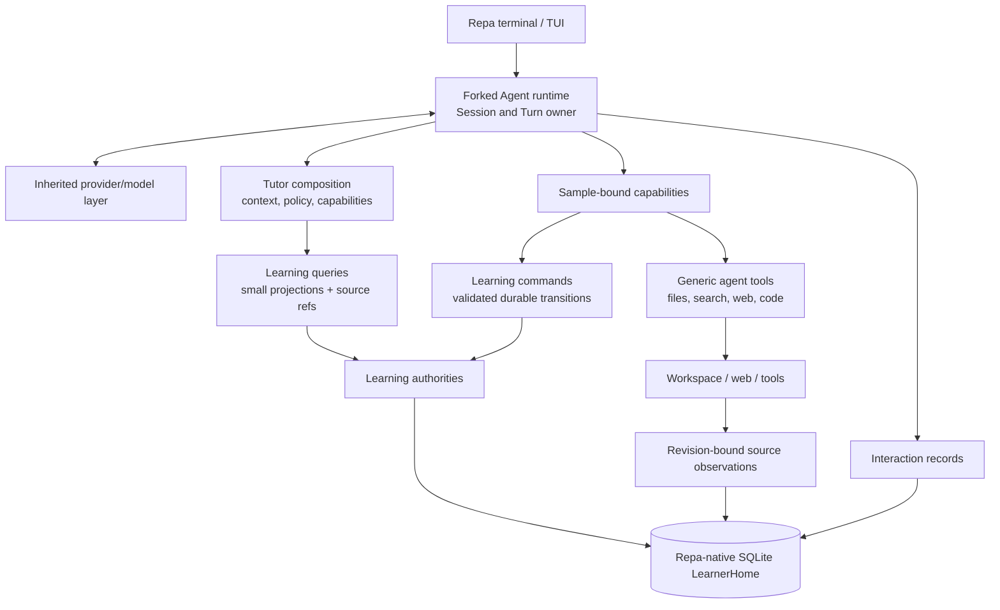

# Repa system architecture

Date: 2026-07-13

Status: Accepted architecture baseline under ADR-0012, with runtime lineage and
native persistence amended by ADR-0014. This document is normative for
ownership, dependency direction, state authority, and failure boundaries.
Names shown in examples are not automatically production types, tables, or
packages.

Carry-forward note: source paths and implementation observations in this
document describe the pre-fork oracle when explicitly labeled as audits. The
ownership, dependency, correction, and failure invariants remain normative for
the production fork.

## Decision in one paragraph

Repa is an independent, single-process, local modular monolith created from a
one-time OpenCode v1 fork and centered on durable learning authorities rather
than on its model loop. One local `LearnerHome` contains a single learner's
state across courses, workspaces, and Sessions. The inherited and transformed
Agent runtime is the Tutor's flexible execution arm: it composes an immutable,
bounded view of relevant state for each model sample, exposes ordinary agent
capabilities and authorized learning commands, and records the interaction.
The LLM may research, teach, choose a local move, propose a course, and initiate
real writes. It does not own the authoritative history, legal transitions, or
cross-Session continuity. One Repa-native SQLite database owns machine state;
local files and observed source content remain revision-bound artifacts. No
daemon runs while the terminal is closed.

In plain language: the program keeps the long-term map and the books; the LLM
looks at the useful part of that map and does the flexible intellectual work.
Starting a new chat does not erase the map, and the whole map is never pasted
into every prompt.

## Product floor and ceiling

The useful floor is already more than chat: begin or form a course, teach from
relevant material, preserve route/progress and real constraints, continue in a
fresh Session, and keep all durable meaning inspectable and correctable.

The intended ceiling includes multiple courses, reusable domain foundations,
source-aware knowledge/capability maps, learner evidence and task families
where justified, adaptive review, assignments and examinations, rich artifacts
and generic Agent tools, and a terminal surface that exposes the system's
reasoning and state. Those capabilities must fit the same authorities and
feedback loop; they must not require rebuilding the product around chat memory,
one scheduler, or one universal ontology.

The ceiling is an architectural compatibility requirement, not permission to
pre-create every future class or table.

## Semantic checksum

| Check | Architecture meaning |
| --- | --- |
| Product-loop purpose | Connect goals, course/material position, teaching, learner activity, review, assignments, deadlines, and later continuation. |
| Owned invariant | Durable learning meaning survives Sessions independently of model context and remains source-linked, correctable, and legally transitioned. |
| Representative behavior | In a new Session, `continue` receives a compact current learning view, chooses a useful move, and reads exact old material or history only if that move needs it. |
| Counterexample | Replaying an old transcript, loading every course node, or trusting an LLM summary as the current learner state. |
| Failure/correction | A failed or stale command commits nothing; a later correction preserves the original source and changes the active projection through a new transition. |

## Architecture drivers and evidence

The design is constrained by executable evidence rather than by a desired
folder layout.

1. The superseded ADR-0011 runner and real-provider dogfood trace establish the
   learning behavior that the fork must preserve; ADR-0014 and the OpenCode
   source audit establish the mature v1 fork and native-database direction.
2. A real fresh Session received active learning-wide state without importing
   the old Session transcript. Session identity is therefore not the learning
   memory boundary.
3. ALS-012 found that a compact overview plus lazy exact reads preserved the
   tested action choice while using about one thirteenth of the model-facing
   input of a full state dump.
4. ALS-008/009 establish bounded reads and revision-bound source observations;
   an unversioned path/range can silently change meaning.
5. ALS-019 proves that an ordered list plus one current pointer loses
   distinctions required for hierarchy, branches, detour/rejoin, deadline
   jumps, relation authority, and material revision.
6. ADR-0003 and ALS-015/016 reject a universal mastery record and an elaborate
   evidence schema before a real future action consumes it.
7. ADR-0008/0009 establish that an LLM can initiate a real write while the
   system retains source, identity, transition, idempotency, and correction
   authority. The physical write-tool transport is generic Agent machinery.

The architecture also incorporates the maintainer's accepted product choices:

- one local learner authority spans multiple courses and Sessions;
- no background daemon is needed while the terminal is closed; and
- when no course exists, the Agent may research and create a coarse,
  correctable working route instead of requiring pre-authored material.

## First-principles model: a mixed-initiative feedback system

Control theory is useful here as an ownership model, not as a claim that the
learner is a passive plant to be controlled. Repa controls **its own future
Tutor behavior** in response to an autonomous learner and a changing world.

| Control-system role | Repa meaning |
| --- | --- |
| reference signal | learner-owned goals, deadlines, intended outcomes, and current steering |
| observed system | learner interactions, materials, assignments, artifacts, time, and external results |
| state estimator | source-aware learner/course/agenda queries; uncertainty remains explicit |
| controller | Tutor composition using hard constraints, current state, learner intent, and model judgment |
| actuator | explanation, demonstration, questions, research, tools, artifact work, and authorized commands |
| feedback | later questions, attempts, corrections, completed work, time changes, and learner overrides |

The controller is receding-horizon: it chooses or proposes a useful current
move and near-term agenda, observes what happens, and chooses again. It does
not compile a whole course into a rigid workflow. This is the same reason plan,
study, review, and assignment behavior remain policy profiles over one loop.

The state also changes at different rates:

| Timescale | Typical authority | Consequence |
| --- | --- | --- |
| slow | domain foundations, course structure, accepted curricular relations | high-inertia; a learner error does not rewrite it |
| medium | material alignment, progress, activities, observations, evidence, correctable hypotheses | changes after meaningful interactions or source revisions |
| planning horizon | assignments, remaining-work estimates, capacity, cross-day allocations, commitments | recomputed when time, progress, estimates, or availability changes |
| fast | current focus, revisits, scoped steering, current learner direction | re-evaluated around each Turn |
| query-time | due/overdue/expired status and time pressure | derived from stored facts and the current clock; no daemon event is required |

In plain language: the course map changes slowly, multi-day work is rebalanced
when its inputs change, today's route can change quickly, and “due now” can
become true simply because time passed.

## Chosen structural style

### Learning-centered modular monolith

All first-version components run in one Bun process and share one SQLite
transaction boundary. Internal modules are separated by the meaning they own,
not deployed as services. This keeps cross-domain corrections and commitments
atomic while avoiding network protocols, distributed locks, and eventual
consistency inside one learner's local system.

The design uses three established ideas selectively:

- **ports and adapters at real external boundaries**: model providers,
  terminal rendering, filesystem/source access, web research, and future
  external applications;
- **functional core plus imperative shell where useful**: pure relation and
  transition rules surrounded by explicit SQLite transaction scripts; and
- **command/query separation**: writes express legal domain transitions and
  reads build consumer-specific projections. This is not a generic command
  bus, separate CQRS deployment, or full event-sourced system.

SQLite is not hidden behind a repository interface merely for architectural
symmetry. A port is introduced only when a real second implementation or
external boundary exists. Domain-specific SQL remains acceptable when its
owner, transaction, and returned meaning are explicit.

### System view



The critical dependency direction is inward: learning authorities never
depend on AI SDK, a provider, or the terminal. The runtime asks them questions
and submits commands; they do not call the model to decide whether a stored
transition is legal.

## Authority and projection map

The first eight rows are separate durable authorities linked by typed
references. The current learning view is their bounded composition output, not
a ninth authority or a stored source of truth. None of these meanings is a
table in one universal graph.

| Authority | Owns | Must not imply |
| --- | --- | --- |
| interaction | Session, Turn, durable item, model operation, tool invocation, terminal outcome, causal source identity | that assistant prose is a learning fact |
| source/artifact | origin, observed content, content revision, selector, license/trust metadata | that source order is the course route or that source text is trusted instruction |
| domain foundation | optional reusable concepts, capabilities, task families, aliases, and reviewed relations | that every course or subject needs a populated foundation |
| course view | one versioned ordered learning/curricular view, its items, authored order, sparse typed relations, and provenance | that one learner mastered it or must study an item today |
| material map | material outline and revision-bound many-to-many alignment to course/domain items | that exposition order proves prerequisites |
| learner record | route progress, meaningful activities, reports, observations, evidence, correctable hypotheses, and source links | a single global mastery score or today's plan |
| agenda | learner-owned goals, assignments, deadlines, revisits, commitments, deferrals, temporary focus, and intended rejoin | permanent curriculum structure or learner ability |
| Tutor policy | hard constraints, policy profiles, scoped learner steering, and future stable defaults | a second runtime or evidence about the learner |
| current learning view | a bounded query result for one model sample | a new source of truth or durable summary that replaces its sources |

### Route anchor, focus, and rejoin

ALS-019 requires three distinguishable meanings, but not three fields in one
table:

- learner/course progress owns the broad route anchor;
- the agenda may own a temporary current focus; and
- the same agenda item may name the intended rejoin point.

The current production slice may physically colocate route-progress storage
with Course View code. That does not transfer semantic ownership to the
curricular structure, and a later Agenda slice must not treat the learner's
anchor as a course revision.

Target composition derives `activeFocus` from the agenda when a live detour
exists; otherwise it derives it from route progress. This prevents two durable
`currentNode` values from drifting while preserving the semantic distinction.
Production does not yet implement durable detour, intended-rejoin, or derived
`activeFocus` behavior; they are ownership requirements for a future consumer,
not current capability.

## LearnerHome, LearningSpace, and Session

`LearnerHome` is the logical root of one learner's local authority. Initially
it may be represented by a database path and home configuration rather than a
new table. It contains multiple `LearningSpace`s, courses, goals, and Sessions.
Several Courses may remain ongoing simultaneously. A Course belongs directly
to LearnerHome rather than to one directory or LearningSpace, and it may use
material from several approved roots or LearningSpaces. The same material may
support several Courses.

An optional durable default Course preference is learner-controlled context
state, not the identity of the only active subject. Invocation directory,
folder layout, discovered material, Agenda pressure, and model judgment may
surface information or a proposed target, but none may change that preference.
Changing it requires an explicit learner request followed by a visible
confirmation bound to the exact target Course/View and current preference
revision; only then may a validated command commit the transition. The learner
can withdraw before commit, and a rejected or stale confirmation changes
nothing.

The default Course preference is only a retrieval prior for underspecified
future requests. When the current request mentions or semantically requires
another Course—or several Courses—context composition loads their bounded
relevant views and the Tutor answers from them without changing the durable
default. This needs no temporary-Course aggregate or `TurnFocus` fact: the
admitted request and context cut already record what the sample consumed. A
confirmed preference change alters only the later fallback when input does not
supply a better target.

A `LearningSpace` is an optional accepted grouping for material, work, and
ordinary context selection. It is not the owner of a Course and is not an
isolation boundary for all learning state: a Course may cross spaces, while a
global deadline, retained steering, or cross-course goal may contribute when
relevant.

Boot uses **global authority with directory routing**. Repa always opens the
same LearnerHome and native database; the invocation directory is a candidate
LearningSpace locator and the default filesystem-permission anchor, not a
database boundary or a Course identity. The product prescribes no filesystem
topology. One learner may keep a single broad learning directory with nested
categories, another may use several unrelated roots, and a LearningSpace may
use a whole root or a bounded subtree. Entering an unknown directory permits an
ordinary Session there but does not silently create a durable LearningSpace or
Course. Directory names and moves remain source-location facts until an
explicit learning operation accepts or reconciles their meaning.

LearnerHome may retain zero or more explicitly approved content roots for
cross-directory discovery. When the invocation directory is inside one of
them, Repa may read and search the approved root while using the current
directory only as a relevance bias. Outside every approved root, the current
directory is the default bounded scope. Repa never climbs to a broader parent
and treats it as approved merely because its contents look educational. Root
approval is a capability fact, not a Course, LearningSpace, or classification.
It authorizes bounded use of selected content by the configured Agent/model as
the ordinary purpose of granting the root, whether that model is remote or
local. Repa adds no content-root-by-provider permission matrix; model/provider
selection and its account/privacy terms remain harness configuration.

An approved root defines the maximum search universe, not the default working
set of every model sample. The current request, current-Course retrieval prior,
Material Map, and explicit resource references compose the default learning
search scope. Ordinary grep/search/read mechanics start there. The Agent may
explicitly widen a search to any approved content root when relevant; this
needs no repeated permission prompt, but the wider scope and bounded result are
visible in the tool record. No implicit “global” search spans all LearnerHome
roots or the computer. An unapproved path still follows the ordinary directory
permission flow.

Repa-owned state, cache, derived-artifact, and system-provided soft-memory
locations are freely writable by the product within their fixed boundaries.
Approval of a user content root does not itself approve mutation. A write under
a content root or narrower working subtree is evaluated separately and may be
allowed once, rejected, or permanently allowed for a canonical path scope.
Permanent path rules are durable, inspectable, and revocable; revocation
changes future authority and does not pretend to undo earlier writes. A broad
content-root write grant and a narrow working-subtree grant use the same
permission mechanism rather than different learning-domain types.

Directory discovery and semantic interpretation have different owners. The
program enumerates only authorized paths, applies ignore and size bounds,
records canonical location, media type and exact content revision, and exposes
a bounded candidate manifest. Deterministic parsers or converters recover
mechanical structure when available. The LLM chooses which candidates merit
inspection and interprets names, nesting and contents to propose groupings,
LearningSpaces, Course Views, or Material Map relations. A capability-scoped
domain command then validates sources, revisions, structure and authority
before accepting a provisional or source-grounded revision. The model cannot
expand its own root access, perform an unbounded hidden scan, or turn a folder
name directly into learning truth.

Discovery is lazy. Approving a root may build or refresh only a cheap,
deterministic, bounded inventory; it does not cause the LLM to read and classify
the tree. Current goals, learner requests, and related source reads trigger
selective semantic inspection. A learner may explicitly request a broader,
budgeted “understand/organize this root” pass. With no background daemon,
inventory drift is noticed on application wake, relevant traversal, or an
explicit refresh. Exact content revisions are bound when bytes are actually
observed or accepted, not guessed from an old inventory entry.

A `Session` is an interaction history. It may begin in one space and later
switch focus; it is not permanently equated with a course. Each Turn records
the resolved learning references in its context cut. A fresh Session starts
with no copied old transcript and receives current state through queries.

Interactive launch opens a sessionless shell with a deterministic current-view
projection. The first ordinary learner input atomically creates a fresh Session
and its first Turn. Before that input, an explicit slash command or CLI option
may continue the most recent Session or select one by identity. A new Session
does not mean new learning state: it receives the bounded current
Learning-System view and can retrieve old detail lazily. An interrupted Session
remains visible and resumable, but restart never silently replays its ambiguous
model or tool work. Repa preserves OpenCode's mature explicit continue
mechanism rather than coupling the latest conversation to the current
directory.

The empty-shell current view is interface state, not placeholder prompt text
and not a synthetic learner item. Deterministic navigation, inspection, and
harness controls belong in the inherited discoverable slash-command/command-
palette mechanism. Executing such a control command does not create a Session,
Turn, or model call unless that command explicitly represents a learner request
whose admission is visible to the learner.

The fork retains OpenCode's existing local control commands when their
observable behavior preserves Repa's Session, Interaction, permission, source,
and learning-authority invariants. Retention is decided per behavior, not by
renaming or copying a command list. Commands such as undo, fork, and compact
must be audited against already committed learning effects; excluded cloud or
sharing commands do not re-enter merely because the UI supports them. The
baseline defines no Repa-specific Tutor slash-command catalog. Such commands
arrive only when a real repeated product action earns one.

## Course, domain, and material ontology

### Course views are graph-shaped, not a generic graph database

A course view uses a versioned ordered hierarchy as its backbone. Only a
relation with an actual consumer becomes a typed cross-relation. Relation kinds
belong to the module that defines their legality; they form a closed set for a
schema version. Unknown or generic `related_to` edges are rejected rather than
accepted as convenient future data.

Each durable curricular assertion retains:

- semantic author;
- source or explicit absence of a source;
- basis such as model-proposed, source-grounded, learner-declared, or reviewed;
- owning course/domain revision; and
- correction or supersession history when it changes.

These bases are not one confidence ladder. An official syllabus can be
authoritative about coverage while saying nothing about a prerequisite. An
application-bound authorship basis is also not causal proof: learner acceptance,
model invocation, and source grounding become durable claims only when their
owning receipt or source authority can bind them. Authorship basis records how
content was created, not whether that content is currently accepted or selected.

A Course may exist before any honest Course View is available. It may retain
several route-strategy Views and their exact revisions, with zero or one
eligible revision selected as the default working view for broad navigation
and durable item targets. Working, historical, and candidate are derived
relations of exact eligible revisions rather than View lifecycle values.
Absence of a view does not authorize a fabricated placeholder route. Other
Views and revisions remain inspectable evidence or alternatives; replacing the
working revision preserves old references and reconciles stable item identities
explicitly. This does not limit LearnerHome to one ongoing Course, and it does
not turn the working view into objective curriculum truth.

A Course View has a stable identity for one continuing route strategy, and its
revisions are immutable snapshots. Revising the same strategy preserves the
View identity; a materially different organization, such as a syllabus route
and an examination-review route, uses a different View. The working selection
pins an exact revision and never advances merely because that View gains a
newer revision. This borrows snapshot/lineage separation from version control
without creating Git-style merge, rebase, or arbitrary branch machinery.

The learner may explicitly author a Course View and may directly request that
an exact candidate revision become the working route. Such a request is the
authorization; Repa does not ask for the same confirmation twice. Repa or the
Tutor may form an unselected candidate from new evidence, but may not silently
redirect the working route. A Tutor-initiated selection change waits for
learner acceptance, while the previous revision and its references remain
intact.

Item continuity across View revisions is conservative and explicit. Rename or
movement may preserve one identity through a one-to-one same-ID mapping. Split
and merge create new target identities; ambiguous many-to-many correspondence
is rejected rather than guessed. Reuse outside an immediate preserve transition
names an exact prior membership of the same Course item. Old learning records
remain attached to their original identities and revisions. A learner may
direct the LLM to author such a transformation under supervision, but fuzzy
title matching or model confidence cannot migrate evidence or other dependent
state.

Ordinary removal of a Course, View, or rejected candidate revision is a
reversible withdrawal from normal discovery and selection, not physical
deletion and not a claim of completion, abandonment, or mastery. Eligibility
requires the Course, View, and Revision all to remain active. A Course
withdrawal can only clear its working selection; a selected View or Revision
may be cleared or legally replaced within the Course. Every withdrawal or
candidate rejection that can observe or change selection compares the exact
expected target and its independent selection version in the same transaction,
so stale model context cannot erase a learner's newer selection. A non-null
replacement also checks the replacement View and Revision's expected versions;
clear and replacement both advance the selection version. Restoration never
selects implicitly. Deep deletion waits until all referring authorities exist
and can present an exact impact scope for explicit learner authorization.

### Domain foundations are optional

A reusable Domain Foundation may later connect several courses to shared
concepts, capabilities, tasks, and high-value relations. A course does not wait
for one. Course items may remain coarse, source-local, or not yet aligned to a
domain concept. This preserves useful behavior in source-grounded and ad hoc
subjects without pretending that every field has a Math-Academy-quality graph.

### Materials remain separate

A material artifact has an origin and current revision. Its outline and exact
selectors belong to a Material Map. Alignment can be many-to-many in both
directions. A material change creates a new artifact revision; it never
silently changes what an old selector meant.

When a source is not conveniently model-readable, an ordinary capability may
offer to derive a readable representation. Translation is optional: the
learner may decline it and continue with whatever bounded use of the original
is possible. An accepted representation is stored canonically in the fixed
Repa-owned artifact area rather than as a sidecar in the learner's content
tree. Source/artifact authority records the exact original revision,
representation path and revision, producing tool and translator revision, and
their derivation relation. The original remains available; later Material Map
selectors bind the representation revision. The learner may explicitly export
a copy, but that user-owned copy is a new artifact rather than the canonical
generated representation. This is a general source reduction, not a PDF
entity or conversion-pipeline subsystem.

Source drift never rewrites or deletes an accepted representation. It makes
that representation stale relative to the new source revision. The learner
may decline further translation, derive a new representation, or explicitly
confirm continued use of the old representation. Continued use stays visibly
bound to the old original and representation revisions; confirmation records
the exact drift pair and does not relabel old bytes as a representation of the
new source. Regeneration is lazy and never an automatic consequence of drift.

Repa does not automatically evict accepted representations or retained source
snapshots. Their bytes are removed only by an explicit learner deletion. The
database preserves identity, lineage, receipts, and a deleted-or-missing state
so historical context cuts never retarget silently. Because the learner can
also edit Repa's local directories directly, artifact access verifies the
expected path and revision: missing bytes become unavailable, not nonexistent.
Relocating exact bytes with the same digest may restore availability; different
bytes are admitted as a new artifact revision. Temporary staging files that
were never accepted remain crash debris rather than durable artifacts.

Repa imposes no universal quality-versus-cost policy for a lossy or uncertain
representation. At the point the distinction matters, the learner may spend
additional model/tool budget to inspect or improve the original, supply or
correct readable content manually, accept the stated ambiguity, or stop using
that source. The exact source and representation actually used remain visible
in the context cut; accepting ambiguity does not silently promote uncertain
text into exact source content.

Representation derivation is not a local-RAG subsystem. Derivation changes how
one exact source revision can be read; retrieval chooses which bounded sources
or ranges are relevant to a request. This boundary admits no automatic corpus
ingestion, chunk ontology, embedding store, vector index, top-k prompt
injection, or background indexing. A later retrieval implementation may query
originals or derived representations, but any index is rebuildable query
machinery rather than source or learning authority.

For a mutable remote source, Repa normally retains the smallest exact snapshot
that materially supported the learning move, not merely a URL and not an
unrequested mirror of the whole site. Source/artifact authority records the
remote locator, observation time, selector, content revision or digest,
acquisition tool, retained bytes or representation, and any known
reproducibility limit. If exact retention is unavailable, the receipt says that
the observation cannot be reproduced instead of treating a future fetch as the
same source. At the learner's request, a web capability may retain the
supported full-page content as another explicit artifact revision. Acquisition
and normalization may be supplied by an ordinary Skill or MCP capability; this
source rule does not require a Repa-owned web-reader subsystem.

When a material revision invalidates a current alignment:

1. the old observed range remains available for audit;
2. the alignment becomes stale rather than resolving against new bytes;
3. the course view and learner progress remain intact;
4. an Agent may propose replacement alignment against the new revision; and
5. unresolved mappings appear in current context only when they affect the
   chosen move.

## Starting without a course or material

Research and route creation use the same Tutor loop and ordinary Agent
capabilities; they are not a separate course-builder runtime.

```text
learner: "I want to learn X"
-> establish or select a goal and LearningSpace
-> inspect local sources and/or research with ordinary read tools
-> model proposes a coarse Course View revision
-> course command validates structure, source references, scope, and identity
-> commit it as a working provisional route
-> teach immediately or refine local detail as the route is used
```

The current learner request authorizes a routine, local, reversible working
route. It does not authorize the model to create verified learner ability or a
hard curricular blocker.

A model-prior-only outline may be used for orientation when explicitly marked
provisional. Source-grounded or reviewed assertions have stronger planning
authority. A later syllabus or curated foundation creates a new course
revision and an explicit reconciliation from old item identities; it does not
turn the first outline into hidden truth or silently discard progress.

Creating a route is optional. A direct learner question may be answered well
without first constructing a course ontology or persisting a plan.

## Epistemic and correction model

Every durable learning statement answers four different questions where they
matter:

1. **What occurred or was reported?** The immutable source-linked history.
2. **What does it support?** Evidence under stated conditions.
3. **What does the system currently infer?** A fallible, correctable
   projection for a consumer.
4. **What did the system or learner decide to do?** A goal, commitment,
   revisit, or other constitutive action.

The architecture does not create a universal `LearningFact` row that erases
these distinctions. Shared provenance fields may be reused, but the owning
domain defines the statement's meaning.

Learner inferences are rebuildable or explicitly superseded projections over
source records. Contradictory observations may coexist. A later failure does
not delete an earlier success, and neither one alone must become a scalar
mastery value. Exact inference rules wait for the future action that consumes
them.

To evaluate Tutor behavior without structuring every conversation, a meaningful
learning activity may retain its intended purpose, target, conditions, and
outcome references when a later decision will compare or revisit it. Ordinary
explanation remains Session history when no such consumer exists.

## Identity and revision semantics

The architecture deliberately rejects one overloaded `revision` number.

| Identity/version | Meaning | Not used for |
| --- | --- | --- |
| Session sequence | order of durable interaction items in one Session | learning-state conflict detection |
| commit sequence | monotonic local order/watermark of committed domain changes | rejecting a command merely because an unrelated course changed |
| entity version | optimistic precondition for one mutable goal, agenda item, progress record, or other aggregate | material content identity |
| course-view revision | immutable identity of one route/structure view | ordering Session messages |
| artifact revision | content identity, normally a digest or source-native immutable revision | learner-state confidence |
| policy profile revision | identity of selected Tutor defaults and enforced overlays | domain evidence |
| context cut | immutable manifest of the exact revisions, references, time, and capabilities shown to one model sample | durable authority after the sample finishes |

The current `system_state.state_revision` may remain temporarily as a coarse
commit watermark for the existing steering slice. New domains must not use it
as a universal stale-write guard. A domain command checks only the entity and
source preconditions that make its own transition legal.

One context cut records a commit watermark for audit plus the typed
dependencies/versions it actually consumed. The next model sample recompiles;
an already-dispatched request never changes underneath the model.

## Context is an observer and working set

Context construction has three depths:

| Depth | Typical contents | Delivery |
| --- | --- | --- |
| routine current view | relevant goals/course candidates, route anchor/current focus, urgent agenda items, time budget, active steering, compact source references | compiled automatically when relevant |
| current-move detail | route neighborhood, exact material range, active assignment/revisit, recent activity or evidence that changes the move | selected during composition or read through a tool |
| cold detail | complete old Sessions, full attempts, superseded interpretations, full course maps, unrelated materials | lazy search/read only |

Read authorization, system-visible resource management, model-visible
retrieval, and learner-visible disclosure are different boundaries.
Source/artifact and Material Map authority may know that a course resource
exists without placing its bytes in every model sample. Composition supplies a
bounded default working set; the LLM uses ordinary search/read tools to inspect
relevant ranges lazily and may explicitly widen them only within the approved
resource universe. Content available to the Tutor model does not thereby
become learner-visible output.

The system resource catalog owns path identity, revision, accepted material
relations, and scope resolution; it is not a second search authority. The
learning-bound search tool can resolve a logical working set or approved root
and reuse the inherited ripgrep engine. A semantic or vector index is admitted
later only if a real corpus demonstrates that bounded ordinary search is
insufficient, and remains rebuildable query acceleration rather than source
authority.

Answer keys, reference implementations, instructor material, and learner notes
use this same path rather than special file types. Names, locations, headers,
and contents may supply soft role evidence; an accepted mapping may supply
stronger source-grounded meaning. An operative learner-response-before-
disclosure constraint normally governs what the Tutor reveals, not whether the
Tutor may know the answer. Only an explicit need for a model-blind attempt
filters the relevant content or read capability from that sample. This reuses
ordinary context and permission mechanics and does not admit an answer
classifier or parallel material-loading system.

Context may also contain **soft workspace memory**: a small, scoped file-backed
contribution for directory conventions, expression/collaboration preferences,
resource paths, working notes, or maintainer summaries. The LLM may manage this
content and initiate ordinary file writes. It remains advisory context rather
than Course, Agenda, Learner Record, or Tutor-policy authority. The host binds
the canonical root, path, digest, scope, loading reason, expected revision,
safety policy, and write receipt; a user can inspect, edit, or delete the source
directly.

Only a demonstrated consumer that needs deterministic calculation, legal
transition, strong conflict detection, permission, or stable learning meaning
promotes file content through an explicit source-linked domain command. This
keeps lightweight memory flexible without letting prose silently acquire
machine authority.

This depth policy governs Learning-System contributions and retrieval across
Sessions; it does not mean silently truncating the active conversation. Within
one Session, model-visible history remains verbatim while it fits the model
window. Near a measured context threshold, the harness compacts an older head,
keeps a recent verbatim tail, and preserves the original durable transcript.
The compaction result is continuation context with provenance, not a learning
fact or replacement for Course, Agenda, or learner-record state. Context-limit
failure and compaction failure remain explicit terminal outcomes.

The first sample in a fresh Session uses the current request, active agenda,
recent durable focus, and small home-level candidates to resolve scope. If
several choices would produce materially different behavior, the context
contains a bounded candidate list and the Tutor asks or chooses reversibly. It
does not load every course to avoid one clarification.

Context composition produces structured contributions before rendering a
prompt:

- selected facts and compact projections;
- typed source references and dependency versions;
- bounded soft-memory contributions with path, digest, scope, and loading
  reason;
- policy contributions with priority and provenance;
- the capability set available to this sample; and
- explicit omissions or truncation when a budget is reached.

Prompt rendering is an adapter over that plan. A prompt string is never the
only record of which state or authority was used.

## Tutor choice and policy arbitration

The program does not enumerate every legal explanation or teaching move. It
owns hard constraints, computable facts, domain legality, and any deterministic
consequence that must always occur. This includes workload/capacity/deadline
arithmetic and recomputation for accepted planning inputs. The LLM owns open
semantic judgment inside that space, including explanation, research, examples,
route proposals, semantic work decomposition, and interaction-level adaptation.
The learner owns goals and can steer or interrupt.

Policy resolves in this order:

1. hard safety, domain legality, and external-effect permission;
2. the learner's explicit current request;
3. still-applicable retained learner steering;
4. real commitments and constraints exposed by the agenda;
5. the selected policy profile and stable defaults; and
6. model judgment for the current interaction.

Agenda facts do not always override the learner; they make the trade-off
visible. A goal change creates or supersedes goal/agenda state and triggers a
new current view. It does not rewrite the course structure or learner evidence.

ALS-021 demonstrates that making a durable reason visible is not equivalent to
selecting it as the purpose of the current move. In all eight tested
independent-prediction returns, the eligible Agenda reason survived into the
fresh Session, yet the Tutor disclosed the answer before the unaided
opportunity that the reason required. Candidate state and selected control
intent therefore need distinct representation in composition.

When the Learning System chooses to let durable state govern a model sample,
the context cut must make that selection inspectable and preserve any
constraint that materially changes the learner's role. The selection may use
model judgment, but it is a Learning System composition decision rather than an
accidental implication of prompt prose. The model still owns flexible
realization: wording, explanation, example, question, representation, and
research. The exact projection is deliberately open; it need not be durable on
every Turn and does not authorize a mode, pedagogy enum, second runtime, or
universal action record.

ALS-022A supplies the first direct realization evidence for that distinction.
Under the same return trace and production model, explicit selected-purpose
binding produced 7/8 purpose-valid independent predictions and no answer
leakage in 8/8; candidate exposure alone had produced 0/8. When durable state
is chosen to govern a move, selected purpose is therefore a real composition
meaning, not an optional wording convention.

The selection is bounded to the current control interval. Agenda continues to
own the candidate; Tutor composition owns the active projection; interaction
owns any completed occurrence. Selection does not address the concern, create
evidence, or survive into a new Turn merely because the candidate remains
durable. Material reads and other non-mutating continuation may preserve the
selection in a newly compiled cut. Failure or interruption ends it without
inventing service.

ALS-022B/C reject a mandatory universal model selector as the baseline.
`Agenda candidate | none` produced false provenance and only 12/22 strict
passes; an exact `current request | candidate | unresolved` source choice still
passed only 10/18 and ignored Agenda in every generic continuation. The
production-default model is not the sole authority for that general control
decision.

ALS-022D supports a simpler bounded topology for the demonstrated
one-candidate case. Composition filters eligibility and target freshness,
preserves exact source meaning, and may bind one legal Agenda concern as a
**conditional default** inside the ordinary realizing sample. The exact
admitted learner request remains higher priority. An incompatible direct
request, requested form, completed occurrence, or redirection overrides the
default without rewriting or closing the concern; generic continuation lets
the default govern. This passed 10/10 tested behavior/state contrasts without
an extra selector sample.

Several materially different candidates remain unresolved unless an accepted
deterministic rule, reversible ordinary model choice, or learner clarification
settles them. Do not hide a universal scheduler or classifier behind the word
selection. The tested conditional default also restated one known
independent-prediction constraint. ALS-022E removed that restatement and strict
validity fell to 3/8: exact source reason plus default status did not reliably
stop answer or decisive-rule disclosure. For this demonstrated concern, Agenda
must preserve an explicit source-bound learner-role constraint equivalent to
`learner response before Tutor disclosure of answer or decisive hint`, and
Tutor composition renders it as operative. It affects both realization and
whether a guided occurrence can truthfully serve the concern. This one earned
constraint does not authorize a general compiler, registry, or pedagogy enum.

If a future model-assisted control sample is justified for another boundary,
it is control-only: it cannot mutate learning state, emit learner-visible
teaching, or share incidental prose with the persisted assistant answer before
the program validates and binds source/version/scope. This remains a phase in
the same finite loop, not another runtime. ALS-022A/D/E also expose a presentation
defect: current pre-tool and control-rationale text can enter learner-visible
`outcome.text`; production Tutor prose must not reveal internal Agenda/control
vocabulary merely because the model narrated it.

A conversational move such as explaining an idea may happen without a domain
transition. Only a move that creates useful long-term meaning, a commitment,
or an external effect needs a durable command. This keeps teaching flexible
without allowing model prose to become authority.

### Teaching and review are feedback behavior, not persisted stages

Repa may observe a learning situation, choose a move, respond to the learner,
and later use a relevant consequence. That describes feedback; it does not
authorize an `Intervention` aggregate, a universal difficulty taxonomy, or a
pedagogical workflow state machine.

Explanation and demonstration remain model-led interaction by default. A
working interpretation such as “the current representation may be the problem”
can guide the next conversational move without becoming a learner record. If a
future action genuinely needs durable meaning, its existing authority owns it:

- route progress owns navigation continuity;
- Agenda owns a specific reason or commitment to return;
- learner history/evidence owns an actual response or artifact and the
  conditions consumed by a later decision; and
- Session history retains the full explanation and immediate dialogue.

Review is a Tutor move, not one stored object type. A durable revisit is an
Agenda-owned, source-linked future-attention concern: there is a reason to
return to a target under a trigger or time condition. It preserves enough
bounded meaning to distinguish why the system should return without absorbing
the old interaction, activity conditions, or learner evidence into Agenda.
`Future-attention concern` is behavioral language for this Agenda meaning, not
a required class name or a generic record shared by all future work.

Beginning the return does not settle the concern. A later recall, explanation,
comparison, application, or real task may serve it only through an explicit,
inspectable transition whose legal, complete later occurrence, target revision,
and purpose align. A partial provider delta or interrupted, uncommitted
assistant item cannot supply that occurrence. Assistance, result, artifact
state, and evidence meaning remain with their owning authorities. Serving the
concern means that the intended future attention occurred; it does not mean the
learner answered correctly, retained the knowledge, or mastered the target.
Cancellation or dismissal is an Agenda decision and does not pretend that the
purpose was served.

Time can make a concern eligible or due without selecting it, beginning it,
settling it, or claiming that the learner forgot. A failed explanation can also
be adapted entirely inside one Session without creating a revisit, difficulty
record, or evidence transition.

The code may derive eligibility, due status, and deterministic lifecycle
consequences. The model may choose or adapt the form of teaching or review when
no accepted rule settles it and may initiate an authorized domain command. The
learner may redirect or request direct help. No universal scheduler or
`FutureAction` record arbitrates all of these meanings.

### Program/model allocation

The boundary is responsibility-based, not a fixed percentage and not a claim
that “program” always decides while “model” only writes prose.

| Program-led | Model-led | Mixed initiative |
| --- | --- | --- |
| identity, revisions, source binding, time math, due/overdue derivation, workload/capacity feasibility, cross-day allocation and recomputation, legal transitions, atomicity, correction mechanics, context budgets, capability/permission enforcement | open-source research, semantic material interpretation and work decomposition, coarse route proposals, explanations, examples, questions, comparisons, and interaction-level adaptation | selecting among genuinely different feasible routes, refining a course view, interpreting open-ended work, forming a gap hypothesis, and adapting a plan where meaning or learner preference matters |

For mixed work, code supplies trustworthy facts, hard boundaries, available
capabilities, and any deterministic consequence; the model supplies semantic
judgment; the learner may redirect. The model may directly commit an authorized
local transition, so “mixed” does not mean every action waits for a hidden
second controller.

In plain language: the program remembers the numbers and does the calendar
math; the LLM understands what the work means and helps teach, split, or adapt
it. Neither replaces the other where both are needed.

## Capabilities and commands

A stable capability definition is separate from its sample-bound executable
binding. The binding receives trusted Session/Turn/model-operation identity,
source references, clock, cancellation, policy, and permission.

The initial capability metadata distinguishes at least:

- read-only local or remote observation;
- reversible local learning-state change;
- workspace/artifact mutation; and
- external or difficult-to-reverse effect.

It may also carry scope, trust of returned content, and a bounded cost/time
policy. This is complete mediation metadata, not a plugin platform.

Generic agent tools can read or change files, search the web, run code, or
produce artifacts. Their outputs are untrusted observations from the learning
domain's point of view. Only an explicit learning command may import one of
those observations into course, material, learner, agenda, or policy state.

A learning command is not generic CRUD. It names a meaningful transition and
owns:

- delegated semantic input;
- trusted execution envelope;
- legal source relationship;
- command-specific causal occurrence and effect identity;
- entity-specific preconditions;
- atomic domain changes and command receipt;
- correction/supersession behavior; and
- a model-visible result.

Every successful state-changing command writes its domain transition,
immutable causal receipt, physical invocation settlement, and exact
model-visible Tool Part result in the same transaction. The fork adapts the
inherited durable-event transaction seam; it does not coordinate a learning
database and an Interaction database after the fact. The receipt links
physical invocation, semantic effect, source/actor, affected domain
references, versions, and time. Domain payload stays in domain-owned records.
This is an audit and recovery ledger, not an event store from which the whole
database must replay.

The receipt and physical invocation settlement form one narrow shared Repa
substrate across learning commands. That substrate owns trusted invocation,
replay/conflict handling, execution context, and exact returned settlement.
Each domain authority separately owns the semantic effect address, legal
transition, entity preconditions, correction, and durable payload. Shared
settlement therefore does not become a universal learning event or a second
owner of domain meaning.

The receipt and the domain records it supports do not inherit Session deletion
lifecycle. Inherited Session, message, part, and event rows may continue to
cascade when a transcript is deleted, but durable learning authorities never
use those rows as cascade-owning parents. Ordinary transcript deletion leaves a
minimal non-content causal receipt marked source-unavailable and preserves the
learning state. Removing or superseding that state is a separate explicit
deep-delete operation whose domain impact is visible before commit.

A cross-domain transition, such as completing an assignment with activity that
also serves a revisit, is one explicit application operation over one SQLite
transaction. It must name both domain consequences; it cannot arise from a
trigger that silently turns every artifact change into learning evidence.

## Runtime and interaction lifecycle

The complete local Agent harness is inherited from and transformed inside the
one-time OpenCode v1 fork. Repa does not rebuild Session, typed-item, provider,
tool, permission, MCP, subagent, compaction, cancellation, recovery, and TUI
mechanics one feature at a time. Learning-specific context compilation,
capabilities, durable state, and Tutor policy remain the architectural center
and extend the ordinary Session lifecycle.

Only the released v1 runner has initial production authority. Preview v2 may
inform a later Repa-owned replacement but cannot create a second Session,
database, tool, or context truth. Local coding capabilities may remain
available; their product semantics do not become learning meaning by default.

The durable path for one Turn is:

```text
boot LearnerHome and recover orphaned work
-> admit learner input and running Turn
-> compile and persist one immutable context/capability cut
-> run one model sample through the native forked Agent mechanics
-> stream live output to the terminal
-> execute generic tools and/or validated learning commands
-> recompile after accepted state changes
-> persist complete assistant/tool outcomes
-> terminate the Turn truthfully
```

Provider deltas are live presentation data. Durable Interaction records contain
complete, typed, correlated items and terminal outcomes. A real learner input,
synthetic or compaction input, model operation, physical tool invocation,
context cut, provider completion, tool settlement, and Turn completion remain
distinct.

At startup, ambiguous in-flight work is marked interrupted and is not blindly
redispatched. Exact settled commands replay their receipts; new semantic work
requires a new admitted occurrence. Finite model/tool budgets remain
code-enforced.

## Persistence, process ownership, and migration

One Repa-owned `repa.db` is the sole machine-state authority for a
LearnerHome. The fork establishes new application paths, a database identity
marker, and forward-only Repa migrations; it does not open or migrate an
OpenCode database or the pre-fork experimental Repa databases by inference.
Large source/material content may stay in local files or a content-addressed
cache; SQLite retains identity, revision, selector, provenance, and any bounded
observed content required for audit.

Admission of a foreign, unsupported-old, future, partially migrated, or
corrupt database stops before mutation and leaves the configured file in
place. Repa reports the observed reason and requires an explicit recovery or
reset action; it does not silently quarantine the file and open a fresh
LearnerHome. Because this is an exceptional path, the baseline owns truthful
refusal and a deliberate reset boundary, not a general repair framework or
automatic salvage policy.

One process owns state-changing execution for a `LearnerHome` at a time. The
state-owning server or worker acquires a local writer lease at boot. A second
ordinary state-owning launch fails clearly; a frontend explicitly attached to
the existing owner is not a second writer. The baseline does not add a read-
only database opener, automatic attach discovery, or a background daemon.

The lease protects LearnerHome authority without making the current v1 TUI
worker topology part of the database or domain contract. Its acquisition and
release remain localized at runtime admission, with truthful stale-owner and
abrupt-exit recovery. A future proven server topology may replace refusal with
attachment without changing database identity, migrations, or learning write
semantics. This matches the accepted single-user baseline while preventing two
terminals from silently running competing Tutors against stale shared state.

SQLite still enforces entity versions and uniqueness. If a conflict occurs,
the later command fails with current state and can be reconsidered; there is no
automatic last-write-wins merge of learning meaning.

Schema migration has one Repa-owned ordered registry and one transaction per
supported migration. Domain modules own the meaning and validation of their
schema changes, but migration execution remains centralized so the database
cannot partially advance. Preview-v2 and upstream post-fork migrations have no
automatic authority. Before a destructive migration exists, backup/export and
rollback behavior must be specified.

The first admitted database is created from the complete Repa baseline schema
and records one Repa baseline identity. Runtime admission does not import
`__drizzle_migrations`, infer completion from inherited OpenCode migration IDs,
or register the inherited migration chain as Repa history. Those source files
may remain as implementation history where useful, but only migrations created
after the Repa baseline participate in the forward runtime lineage.

There is no timer worker or daemon. At application wake, queries derive due,
overdue, and expired state from stored times and the trusted clock.

## External and untrusted boundaries

- Material, web, and tool output is untrusted content, never privileged prompt
  policy.
- Model-written workspace memory is advisory, scoped content. It cannot grant
  capabilities, override current learner intent or typed policy, or assert
  learning evidence merely by being loaded.
- Filesystem tools are confined to declared LearningSpace/workspace roots
  unless the learner grants a broader capability.
- Provider and model identifiers are runtime metadata, not learning evidence.
- External writes use explicit permission and connector-specific idempotency or
  reconciliation; they are not covered by the local SQLite transaction.
- Secrets and provider transport metadata never enter learning context or
  durable research artifacts.

## Failure and correction behavior

| Failure | Required behavior |
| --- | --- |
| provider error or cancellation | preserve admitted input; fail/interrupt the model operation and Turn truthfully; do not invent assistant completion |
| crash during a local learning command | SQLite commits both domain effect and receipt or neither; recovery returns settled state by identity |
| crash during provider/text work | close/recover as interrupted; do not automatically repeat ambiguous model or external work |
| stale entity or course revision | reject the command with current references; let the Tutor re-read and decide again |
| material content drift | fail the old selector closed; preserve old observation; propose explicit re-alignment |
| poor provisional course route | create a corrected/superseding revision and reconcile item lineage; retain the old route as provenance |
| learner corrects a report or inference | append correction/supersession; preserve the original source; rebuild active projections |
| generic tool changes an artifact | record the artifact/tool result; create no learner/course fact until an explicit domain command imports it |
| context omitted relevant state | model may inspect state lazily; recorded selection manifest and source refs make the omission diagnosable and correctable |
| conflicting local writer | reject/serialize through the LearnerHome owner and entity preconditions; never silently merge semantic state |

## Target module ownership

The concrete logical relationships and post-Gate-6 staged native admission
boundaries are specified in the
[native learning data model](./01-native-learning-data-model.md). This section
owns dependency direction; that document owns native data meaning and staged
admission.

The full fork is one Repa product, not OpenCode plus a learning package. Its
logical ownership remains:

```text
Repa product composition
  interaction/harness       Session, Turn, typed item, model/tool lifecycle
  sources/artifacts         origins, revisions, representations, selectors
  curriculum/materials      Course View, Material Map, alignment
  learner                   progress, activity, evidence, inference
  agenda                    goals, assignments, revisits, commitments
  tutor policy/context      scoped policy and bounded sample composition
  outer capabilities        providers, files, shell, web, MCP, subagents
  terminal                  Repa CLI/TUI projection
  database composition      one repa.db, migrations, transaction utilities
```

Inherited package names may remain while the fork is stabilized; they do not
define the product's domain ownership. Directories are renamed or split only
when a real import, release, or maintenance boundary requires it. A global
brand rename is not a substitute for changing default behavior and authority.

Learning modules may depend on small shared identity/provenance primitives and
native SQLite utilities, but not on AI SDK, provider implementations, terminal
code, or the fork's Session service. Tutor context uses read projections and
performs no domain writes. The outer runtime may depend inward on application
boundaries; nothing inward depends back on the runtime.

## Pre-fork oracle audit

The pre-fork production spine exists only in the immutable oracle tag and
read-only oracle worktree. It is executable evidence, not source present in the
fork to be deleted at cutover. It is not extended, imported as a compatibility
layer, or treated as the final package topology.

| Pre-fork oracle shape | Architectural treatment |
| --- | --- |
| `run-tutor-turn.ts`, pre-fork CLI/provider adapter, and `interaction/records.ts` | retain in the immutable oracle as Turn/context/tool/failure evidence; never import or edit them during fork cutover |
| pre-fork `session_item`, `model_operation`, `tool_invocation`, `system_state`, and `durable_effect` tables | do not migrate or mirror; preserve accepted invariants through the native Session/message/part and domain schemas |
| Course, material, Agenda, policy, and context modules | port their owned semantics and behavioral tests; rewrite trusted identities, transactions, and foreign keys against the native database |
| pre-fork AI SDK tool bindings | leave in the oracle; bind learning capabilities independently through the fork's native tool admission and atomic settlement path |
| pre-fork one-string assistant history | replace with inherited typed items; never preserve flattened output for compatibility |
| pre-fork production tests | classify as invariant or old API; port invariant assertions and leave old-API-only tests as historical oracle evidence |

This is a deliberate substrate replacement. The cutover remains gated so the
fork is not declared the sole product line before its native path proves
equivalent or better behavior; the oracle itself remains immutable afterward.

## Rejected centers of gravity

### Agent-loop-centered layered application

Rejected because context selection, tool definitions, domain SQL, and Tutor
policy would continue accumulating in `runTutorTurn`. The Agent loop is a
necessary execution mechanism, not the product's long-term state model.

### One global learning state machine

Rejected because open teaching, research, learner interruption, and mixed
activities do not share one legal pedagogical sequence. Bounded objects such as
a Turn, assignment, tool invocation, or correction may still have explicit
state machines.

### Event-sourced blackboard or universal graph

Rejected as the default because it makes every interaction conform to one
event/edge language and requires generic projection/replay machinery before a
consumer exists. Repa borrows immutable receipts, provenance, and derived
views without making event replay or one graph table the source of truth.

### Artifact-centered workspace

Useful as an adapter and source model, but insufficient as the architecture
center. Files do not by themselves own goals, due revisits, course progress,
evidence meaning, or cross-Session Tutor policy.

### Microservices or remote runtime as the product center

Rejected until a real remote or multi-user owner requires it. The fork may
retain an inherited loopback server and local plugin/MCP mechanics as harness
facilities; they do not divide the learning authorities into services or own
product meaning. Package count is not future-proofing.

## Architecture fitness rules

Every production extension must answer:

1. Which product-loop step does it improve?
2. Which authority owns its durable meaning?
3. Is it a command, a query/projection, an interaction record, or an artifact?
4. Which source, revision, and correction path make it inspectable?
5. What enters routine context, what is current-move detail, and what stays
   lazy?
6. What happens on retry, stale input, interruption, and restart?
7. Can the behavior be reduced to an inherited mechanism without losing its
   learning contract? If not, which failed invariant justifies new machinery?

Architecture-level behavioral checks must continue to cover:

- a fresh Session uses relevant state without transcript replay;
- context does not eagerly load full courses/materials/history;
- generic tool output cannot mutate learning state by itself;
- goal changes alter agenda without rewriting course/evidence;
- one learner error does not mutate shared curriculum;
- provisional model routes remain visibly provisional and correctable;
- stale material selectors fail closed; and
- domain code has no dependency on provider or terminal packages.

## Deliberately deferred

- multi-user, cloud, or cross-device synchronization;
- account, sharing, marketplace, and other group-product surfaces;
- a background daemon or notification scheduler;
- property-graph or vector databases;
- a universal knowledge or learner ontology;
- microservices, HTTP APIs, or remote runtime placement;
- full event sourcing and deterministic replay of model work;
- a universal scheduler score or global mastery scalar;
- a fixed workflow for teaching; and
- detailed production types whose first consumer has not arrived.

These omissions do not make the architecture a disposable MVP. The durable
boundaries that prevent future pile-up—authority separation, dependency
direction, version semantics, context stratification, correction, and command
ownership—are fixed now. Feature-specific shapes remain deliberately earned by
their first real behavior.
