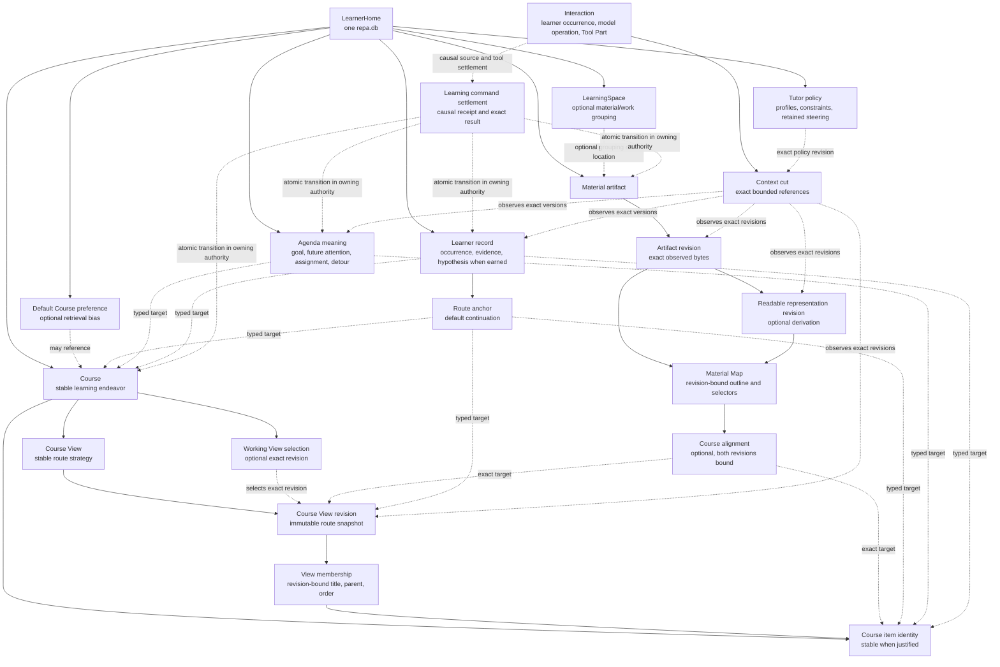

# Native learning data model

Status: Accepted post-Gate-6 logical data design. It governs the first
learning-owned migrations in the OpenCode fork without freezing every future
table, command, or learner ontology.

Date: 2026-07-14

Authority: [Product origin](../foundation/00-product-origin.md),
[ADR-0012](../decisions/0012-learning-centered-modular-monolith.md),
[ADR-0014](../decisions/0014-one-time-opencode-fork.md), and the
[system architecture](./00-system-architecture.md).

Historical evidence: the immutable pre-fork Course, material, Agenda, Tutor,
and Interaction behavior oracles identified by the
[asset audit](../research/pre-fork-repa-asset-audit-2026-07-13.md). Their
meanings and counterexamples are evidence; their tables and APIs are not a
migration target.

## Purpose

Gate 6 established one native `repa.db` and a Repa-only forward migration
lineage, and accepted one state-owning process per LearnerHome as the runtime
invariant. A later audit found that path aliases and configurable lock roots can
bypass the current lease implementation; that bounded runtime correction does
not change this logical data design. Gate 6 deliberately added no learning
tables. Before the fork extends Interaction in isolation, this document fixes
the learning data relationships that the native runtime must eventually serve.

The design is intentionally between two bad extremes:

- it is more complete than adding one field whenever the latest local task
  happens to need it; and
- it is less rigid than materializing every old noun, transition, test fixture,
  or possible learner inference before a product consumer exists.

The stable target is a learning system whose normal context and actions can use
Course, material, learner, Agenda, and policy meaning across Sessions. Exact
physical schemas are admitted in coherent product slices. Empty future tables
do not make learning first-class.

Before the roadmap is divided into implementation Gates, this document fixes
the shared logical skeleton across those authorities: stable identity,
ownership, version/provenance/correction relations, cross-authority reference
direction, authoritative versus projected state, and transaction/dependency
boundaries. It deliberately leaves complete physical schemas, commands,
algorithms, package names, and locally evidenced lifecycle details to later
Gate design.

## Decision summary

1. One LearnerHome owns all Courses, learning records, Agenda meaning, and Tutor
   policy in one database. A LearnerHome may be implicit in the database
   identity; every table does not need a redundant learner-home foreign key.
2. Several Courses may be ongoing at once. No global `active` Course status is
   introduced. An optional default Course preference is only a retrieval bias
   for underspecified input such as `continue`.
3. A Course is not owned by a directory or LearningSpace. It may use material
   from several approved roots or LearningSpaces, and the same material may
   support several Courses.
4. A Course may exist before any Course View has been formed. It may later
   retain several View strategies and their exact revisions while selecting
   zero or one eligible revision as its default working view. `Working`,
   `historical`, and `candidate` are derived relations of eligible revisions,
   not stored View lifecycles: the selected exact revision is working, an
   unselected revision with a later eligible revision in the same View is
   historical, and the latest eligible unselected revision is candidate.
   Absence of a working view is valid state, not an error that authorizes an
   invented placeholder route. A selection is correctable working state, not a
   claim that the view is the one true curriculum.
5. Course structure, material structure, learner continuity, temporary work,
   and current model context remain different meanings even when they reference
   the same item.
6. The current learning view is a bounded, immutable observation for one model
   sample. It references exact durable revisions; it is never another source of
   learning truth.
7. Physical learning tables may enter incrementally when their identity,
   ownership, legal transitions, failure behavior, and place in the accepted
   architecture are concrete enough to implement and verify. A Gate need not
   complete an end-to-end product loop. Empty speculative tables and knowingly
   false placeholder semantics remain out of scope.

## Logical relationship map

The diagram shows ownership and references, not required package or table
names.



There is deliberately no ownership edge from LearningSpace to Course or
artifact. LearningSpace may group work or locations; Course and material meet
through optional, revision-aware alignment rather than filesystem ancestry.
Stable Course View identity names one continuing route strategy, while each
View revision is an immutable snapshot of that strategy. Stable Course item
identity is Course-owned while title, parent, and order are View-revision
membership. Route anchor is learner-record meaning. Command settlement crosses
authorities without becoming another domain owner.

## Authority records

### Interaction and causal source

The inherited baseline already stores Session input, typed messages, parts,
events, tool activity, and terminal outcomes. Native learning records reference
the exact admitted learner occurrence, completed assistant/tool occurrence, or
other trusted source that gave the write its basis.

Current Session deletion cascades through messages, parts, and the Session
event aggregate. Durable Course, Course View, material, learner, Agenda, route,
and policy records are not cascade children of those inherited tables. Their
causal relationship uses a Repa-owned durable receipt that may retain the
original Interaction identifiers but does not require transcript content to
survive. Ordinary Session deletion removes the transcript and marks that source
unavailable while preserving independently owned learning state. A later
explicit deep-delete operation may remove or supersede affected learning state
after showing its domain impact.

Truly Session-scoped projections, temporary runtime focus, streamed Parts, and
tool presentation remain Interaction-owned and may follow Session deletion.
This distinction is ownership, not a ban on provenance links.

The implementation must preserve distinct logical identities for:

- admitted learner occurrence versus replayed, synthetic, or compacted text;
- one provider/model sample;
- one physical tool invocation and its settled model-visible result;
- one immutable context cut; and
- the terminal lifecycle that says whether an occurrence actually completed.

These requirements do not authorize copies of the old `session_item`,
`model_operation`, `tool_invocation`, `system_state`, or `durable_effect`
tables. The first learning command must map the meanings onto existing
Session/message/part/event records and add only a missing identity or manifest
that a real consumer cannot otherwise recover honestly. Current provider
`callID` payloads and per-Session event sequence numbers are not universal
command, effect, or LearnerHome revision identities.

The missing cross-cut is one narrow shared command-settlement substrate. It
owns causal receipts, physical invocation replay/conflict, trusted execution
envelopes, exact model-visible results, and source-unavailable tombstones. It
does not own semantic learning effects. Course, source/material, learner,
Agenda, and policy commands define their own effect addresses, transitions,
preconditions, and corrections and commit them with the shared settlement in
one SQLite transaction where all effects are local.

### Course

A Course is a stable LearnerHome-owned learning endeavor with a broad route. It
may represent a school course, a self-directed subject, examination preparation,
or another sustained body of learning. Its identity outlives directory moves,
material replacement, Session boundaries, and changes to its working route.

Several Courses may remain ongoing simultaneously. The baseline therefore
adds no single Course lifecycle column whose value implies that all other
Courses are inactive. Archiving, completion, abandonment, and institutional
enrolment become durable meanings only when a visible consumer requires them.

An optional default Course preference belongs to LearnerHome context selection,
not to Course lifecycle. It changes only through an explicit learner-controlled
operation. A Turn may load one or several other relevant Courses without
changing that preference. Current directory, material discovery, Agenda
pressure, and model preference cannot mutate it implicitly.

### Course View

A Course View has a stable identity for one continuing way of organizing the
Course route. Editing that same organizing approach creates another immutable
revision of the View; proposing a materially different organizing approach
creates another View. For example, a syllabus View and an examination-review
View can coexist, and each can accumulate its own revisions. This resembles
the useful Git distinction between a continuing branch and immutable commits,
but it does not import Git merging, rebasing, arbitrary branching, or a general
version-control API.

A Course can retain multiple immutable revisions and multiple unselected Views
with different provenance. A separate, versioned optional selection identifies
the exact default working revision used for broad navigation and durable
targets. It never follows a later revision automatically. Course creation does
not create that selection or require a placeholder View; the first working View
is attached through a later explicit transition when no honest route is
available yet.

The working revision may be provisional and model-proposed, source-grounded,
learner-declared, or reviewed. These bases describe provenance, not a single
confidence score. Before causal command settlement exists, a Course revision
can retain only an application-bound authorship-basis declaration; that value
is not proof of a learner message, model invocation, acceptance, or source
content, and it records creation basis rather than current acceptance state.
Replacing the working revision preserves the previous view and reconciles
surviving item identities explicitly; it never rewrites old references.

The learner may explicitly author a View or request that an exact candidate
revision become the working route. That request authorizes the selection
transition without a redundant confirmation. Repa or the Tutor may also form
an unselected candidate from new evidence or a proposed reorganization, but
candidate formation never mutates the working selection. A Tutor-initiated
selection change requires learner acceptance. This separates low-friction
proposal from authority to redirect later navigation.

The backbone is a bounded ordered forest. Stable Course item identities are
separate from their title, parent, and order within one View revision so useful
continuity can survive a revision. A preserve mapping is one source to one
target with the same stable ID; a split is one source to several new IDs; a
merge is several sources to one new ID. An unmapped source or target means
removal or addition. Ambiguous many-to-many transformation is not silently
reduced to either operation. Reusing an item outside an immediate preserve
transition, including in the first revision of another View, names an exact
same-item source membership. Old references remain bound to their original
identities and revisions.

The learner may direct the LLM to author a split, merge, or identity mapping
under learner supervision. The Course authority validates exact source and
target revisions, ownership, uniqueness, and mapping shape before accepting
the new revision. The learner's instruction can authorize the operation, but
neither title similarity nor model confidence silently migrates learner
evidence, Agenda targets, or other downstream records. Gate 7 owns the domain
representation and transition and accepts authorship basis only from a trusted
application capability, never from model-authored content. Gate 8 later binds
an LLM-issued invocation and learner acceptance to trusted causal settlement.

Ordinary removal of a Course, View, or rejected candidate revision is a
reversible withdrawal from ordinary discovery and selection. Withdrawal is a
separate disposition over immutable identity and revision content; it does not
mean completed, abandoned, or mastered. A working selection cannot point to a
withdrawn Course, View, or Revision. Withdrawing a Course therefore clears its
selection; it cannot replace the target because every Revision it owns becomes
ineligible. Withdrawing a selected View or Revision may clear or legally
replace the target inside the same Course. Every rejection or withdrawal that
may observe or change working selection compares both the exact expected target
and the independent selection version in the same transaction. A stale
proposal therefore cannot withdraw a candidate after the learner has selected
it. A non-null replacement must also satisfy ordinary selection's target View
and Revision version checks, preventing withdrawal-and-restoration ABA; every
successful clear or replacement advances the selection version. Restoration
makes the retained object eligible again without selecting it or rewriting
history.

Eligibility is hierarchical: Course, View, and Revision must all be locally
active. No View or revision is created under a withdrawn container, and a child
cannot be restored while its parent remains withdrawn. The exact Gate contract
owns the transition matrix and bounded hierarchy constants; these rules are
stable data meaning rather than UI convention.

Gate 7 defines no physical deep-delete command. Once later authorities can
refer to Course and item identities, deep deletion requires an explicit scope
calculation and learner authorization across those owners. Raw absence and
ordinary withdrawal must not masquerade as one another.

Only a demonstrated query admits a typed cross-relation. There is no generic
`related_to` edge table, open-ended relation registry, or requirement to model
all prerequisite, alternative, and joint-choice semantics in the first schema.

### Material and representation

A material artifact is a logical source whose locations may change. An
artifact revision identifies exact observed content. A location inside an
approved root is a capability and provenance fact, not the artifact's learning
identity and not a Course owner.

A model-readable derived representation, when needed, has its own immutable
revision and records:

- the exact original artifact revision;
- translator/tool identity and revision;
- media type, digest, and canonical Repa-owned location;
- acceptance time and physical tool settlement; and
- availability, explicit deletion, or externally missing bytes without
  retargeting history.

Readable original content does not need a fake translation row merely to fit a
uniform pipeline. Selectors and alignments state whether they bind the original
or a derived representation. The physical schema may share content-revision
primitives when that removes duplication without erasing the derivation
relation.

A Material Map owns the outline/selectors of one exact material or
representation revision. Alignment from material ranges to Course items is
many-to-many and revision-bound. Source order never becomes a Course route by
implication, and a Course may use material from several LearningSpaces.

### Learner continuity and record

The first learner-owned durable meaning is a broad route anchor per Course: the
default place from which an underspecified continuation can resume. It is not
the current Turn's exclusive focus and does not imply that the learner mastered,
understood, or even completed the referenced item.

A temporary detour or selected current task belongs to the current request or
Agenda. When durable, it may name an intended rejoin point. Context composition
derives the current focus from the request and live Agenda meaning, falling
back to the route anchor only when no better target exists. The system never
stores two competing generic `current_item` fields.

Other learner records enter as separate source-linked meanings only when a
future Tutor action consumes them. Reading, receiving an explanation, watching
a demonstration, attempting with help, producing an artifact, observed
performance, evidence, and a model hypothesis are not synonyms. The design
does not pre-authorize one universal activity table, mastery score, or enum for
every possible interaction.

The first continuity slice may use the route anchor and exact recent
Interaction references without creating a general learner ontology. A later
adaptation path must admit only the modest occurrence/evidence distinctions it
actually uses and retain correction provenance.

### Agenda

Agenda is an ownership area, not one universal `agenda_item` aggregate. Goals,
future-attention concerns, assignments, commitments, deferrals, and temporary
focus have different sources and legal completion meanings. They may share
small identity, time, and target primitives while retaining separate lifecycle
contracts.

Goals may be LearnerHome-wide, Course-scoped, or span several Courses. A Course
therefore has no mandatory single `goal` field. Immediate Turn intent remains
Interaction meaning unless it must survive the Session and alter later action.

The first accepted Agenda consumer remains source-linked future attention:
eligible does not mean mandatory, begun, served, correct, or mastered. Native
Agenda tables are admitted with the later teach-adapt-return path, not as empty
companions to the first Course migration.

Assignment planning waits for representative multi-day workload, capacity,
allocation, correction, and recomputation behavior. The withdrawn minute-scale
emergency schema and its compatibility tombstone are not design inputs.

### Tutor policy and context cuts

Tutor composition queries bounded projections from the authorities above. One
context cut records the exact Interaction position, Course/View revisions,
material/representation revisions, learner/Agenda entity versions, trusted
time, policy revision, and granted capabilities actually shown to one model
sample.

The cut is an audit and stale-write precondition. It is not a durable summary
that can overwrite its sources, and its serialized JSON is not the learning
database. Detail remains lazy: the ordinary sample receives route neighborhood,
live constraints, and source references; exact material and old history are
loaded only for the selected move.

## Native structural families

The accepted logical model implies the following structural families. They may
be implemented and verified incrementally. This list does not require one Gate
to complete a user-visible trace and does not pre-assign Gate order.

The resulting schema may eventually represent the following record families,
but each family first appears only with a demonstrated consumer:

| Consumer pressure               | Record family                              | Required relation or behavior                                                                                                                                               |
| ------------------------------- | ------------------------------------------ | --------------------------------------------------------------------------------------------------------------------------------------------------------------------------- |
| native Course use               | Course identity                            | LearnerHome-owned; no LearningSpace owner and no global active status                                                                                                       |
| native Course use               | default Course preference                  | optional, versioned learner-controlled retrieval bias                                                                                                                       |
| native Course use               | Course View identity                       | one stable identity per continuing route strategy; alternatives remain distinct within a Course                                                                             |
| native Course use               | Course View revision and working selection | immutable revisions per View, zero or one exact working selection per Course; a Course without a View is valid and selection does not follow a newer revision automatically |
| native Course use               | Course item identity and View membership   | Course-owned stable identity where justified; revision-bound title, parent, and order                                                                                       |
| exact material use              | artifact and exact revision                | mutable location separated from exact observed content                                                                                                                      |
| exact material use              | readable representation                    | optional exact derivation from one artifact revision with availability truth                                                                                                |
| material structure              | material map                               | exact selectors bound to one artifact or representation revision; no Course dependency                                                                                      |
| grounded material use           | Course alignment                           | optional many-to-many relation bound to exact material and Course View revisions                                                                                            |
| durable continuation            | route anchor                               | learner-record-owned Course/View/item reference, distinct from current focus and mastery                                                                                    |
| first durable command           | causal source and command receipt          | trusted Interaction/source identity and atomic domain/tool settlement                                                                                                       |
| exact continuation, if required | context cut                                | exact bounded manifest when existing Interaction records cannot express it honestly                                                                                         |

An accepted Gate may establish any causally sound subset whose invariants and
integration boundary are real. This document neither authorizes empty future
tables nor decides whether Course, material, and continuation belong in one
Gate or several.

No early native table is created for generic learner activity, evidence,
mastery, Agenda, Assignment, scheduling, Domain Foundation, embeddings, or a
universal graph. Those are not omitted from the product; they enter through the
next behavior that can state their honest meaning and consumer.

## Migration and command rules

- Gate 6 baseline version 1 remains unchanged. The first learning schema is a
  normal Repa-owned forward migration in the empty post-baseline registry.
- Fresh databases continue to receive the generated complete current schema;
  existing recognized Repa databases advance through the same ordered
  migrations. No oracle or OpenCode journal is imported.
- A learning command validates only its actual source, entity, working-view,
  material, and permission preconditions. A global revision is not a universal
  stale-write guard.
- Domain transition, immutable domain receipt, physical Tool Part settlement,
  exact model-visible result, and required Interaction projection commit in one
  SQLite transaction when all effects are local.
- External conversion or filesystem work completes before a short acceptance
  transaction. A crash may leave unreferenced staging bytes, never a database
  reference that falsely claims available accepted content.
- Generic file, shell, search, or model activity creates no Course, learner, or
  Agenda fact without a capability-scoped domain command.
- Corrections preserve old sources and revisions. No command silently retargets
  history to new bytes, a new view, or a different Course item.

## Design checks

The model fails if any implementation requires one of these false equations:

```text
Course = directory or LearningSpace
default Course preference = the only ongoing Course
working Course View = objective curriculum truth
route anchor = current Turn focus = mastery
material outline = Course route
Session transcript = long-term learner state
context JSON = authoritative learning storage
tool invocation ID = semantic learning identity
Agenda item = goal = assignment = revisit
explained or read = understood or retained
```

It also fails if a supposedly narrow first migration forces later authorities
to use compatibility columns, duplicate current pointers, untyped JSON facts,
or a universal event/graph table to escape the initial shape.

## Deferred physical choices

The following remain implementation questions because current product meaning
does not select one answer yet:

- whether an existing Session message ID can also be the model-operation
  identity or a narrow additional record is required;
- exact table and package names;
- the first typed Course cross-relation beyond hierarchy and authored order;
- when a material grouping earns a durable LearningSpace entity rather than
  remaining roots plus explicit Course/material relations;
- which modest activity occurrence first changes Tutor adaptation beyond route
  continuity; and
- retention, evidence aggregation, review scheduling, and long-horizon planning
  algorithms.

These choices are resolved by the product Gate that consumes them, without
reopening the ownership and non-implication decisions above.
