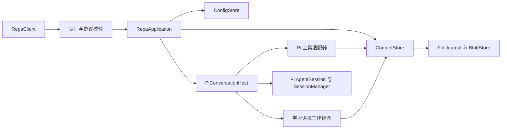

# 开发指南

本目录面向实现后端、Web、Desktop、公开客户端和能力适配器的开发者，说明当前代码的责任与调用方式。修改所属模块时同步维护相应说明。产品概念由根目录 [CONTEXT.md](../../CONTEXT.md) 持有，架构取舍由 [ADR](../adr/) 持有，尚待实现的接口建议集中在 [Issue #16](https://github.com/Utopia-V/repa/issues/16)。早期原型的代码结构和测试只说明当时的实现，不能代替已接受的产品设计。

## 参与开发

从 [Issue #5](https://github.com/Utopia-V/repa/issues/5) 领取任务并确认其开发基线，然后在仓库根目录安装依赖：

```sh
npm ci
```

按工作范围选择入口：

| 范围 | 开发命令 |
| --- | --- |
| 后端与 TUI | `npm run dev:backend -- /path/to/learning-space` |
| 独立后端联调 | `npm run dev:backend -- serve --connection-file /absolute/path/connection.json` |
| Web | `npm run dev:web` |
| Desktop | `npm run dev:desktop` |

Web 和 Desktop 会自动构建并启动各自的开发后端，不需要手工填写连接地址或令牌。提交评审前在根目录运行 `npm run check`、`npm test` 和 `npm run build`；具体代码入口见下一节。

## Web 界面

Web 与 Desktop 的主应用启动、连接提示和工作台侧栏已使用相同的语义 token 与组件行为；连接生命周期分别由各自的 `app.tsx` 持有。工作台默认进入 `/sources`，各导航路由的右侧内容暂时留空；侧栏接入与示例数据边界见设计系统实现说明。

Web 开发约束见 [apps/web/AGENTS.md](../../apps/web/AGENTS.md)。

稳定视觉规则见 [DESIGN.md](../../DESIGN.md)，相关取舍见 [ADR 0006](../adr/0006-govern-frontend-visuals-through-a-semantic-design-system.md)。通用视觉由 `components/ui` 持有，业务组合位于 `components/domain`，页面负责布局。当前文件责任、主题适配、迁移范围、启动与验证入口统一见[设计系统实现说明](../design-system-implementation.md)。

## 工程边界

后端、CLI、公开客户端与协议位于 `packages/repa` workspace。完整 Web 前端和完整 Electron 前端分别位于 `apps/web` 与 `apps/desktop`，各自持有页面、路由、应用状态和宿主进程接入。仓库根目录持有唯一锁文件和统一命令，包内的相对路径用于实现与测试；renderer 只通过 `repa/client` 和 `repa/protocol` 使用后端能力，Node 宿主把现有 `repa serve` CLI 作为进程边界。

Web 入口创建 Browser Router，Electron renderer 创建 Memory Router，两端分别维护自己的路由配置和启动状态；连接建立是进入路由前的应用启动条件，不是业务页面。Web 的 Vite 开发宿主以进程专属连接文件启动现有 CLI，并通过同源端点提供临时连接；Electron main 以应用专属连接文件启动现有 CLI，并由隔离 preload 暴露 `getConnection`。renderer 调用 `RepaClient.connect`，连接恢复和状态投影继续由公开客户端持有。相似界面不通过通用 shared package 复用；出现多个真实调用方和稳定契约后，再按具体职责提取前端 package。

公开方法以当前提交的 [protocol.ts](../../packages/repa/src/protocol.ts) 及其导入的 schema 为准。协议仍为 v1，联调时固定双方使用的源码或构建提交。

模块任务及其依赖关系见[实施入口 #5](https://github.com/Utopia-V/repa/issues/5)。[插件宿主 #20](https://github.com/Utopia-V/repa/issues/20)尚待实现，范围是通用调用与按需生命周期接入；算法、数据库实体和迁移由插件负责，适用的存储辅助库可作为可选依赖共享。数据责任见[ADR 0003](../adr/0003-share-file-based-content-operations.md#能力数据与数据库)。

## 从哪里开始

| 工作 | 入口与责任 |
| --- | --- |
| 修改 Web 页面、路由或开发宿主 | [app.tsx](../../apps/web/src/app.tsx)、[routes.tsx](../../apps/web/src/routes.tsx) 持有界面与路由；[repa-development-backend.ts](../../apps/web/repa-development-backend.ts) 与 [vite.config.ts](../../apps/web/vite.config.ts) 持有开发期后端启动和连接交付 |
| 修改 Desktop 页面或原生边界 | [app.tsx](../../apps/desktop/src/renderer/src/app.tsx)、[routes.tsx](../../apps/desktop/src/renderer/src/routes.tsx) 持有界面与路由；[main/index.ts](../../apps/desktop/src/main/index.ts)、[repa-process.ts](../../apps/desktop/src/main/repa-process.ts) 与 [preload/index.ts](../../apps/desktop/src/preload/index.ts) 持有进程和窄 IPC 边界 |
| 接入前端、读取状态或保存内容 | [client.ts](../../packages/repa/src/client.ts)：标准 WebSocket、Fetch、协议校验和状态副本，不依赖 Pi 或后端模块 |
| 增加公开调用 | [protocol.ts](../../packages/repa/src/protocol.ts)、[server.ts](../../packages/repa/src/server.ts)：参数和结果校验、认证、传输；内容契约在 [content/protocol.ts](../../packages/repa/src/content/protocol.ts) |
| 处理应用内的操作顺序与退出 | [application.ts](../../packages/repa/src/application.ts)：空间实例、请求受理、配置固定、订阅与进行中工作；释放空间前等待 Agent 和内容操作收尾 |
| 修改正文、身份、组成或学习语境 | [内容与保存](content.md)：共同的版本检查、文件操作、资源和恢复入口 |
| 修改模型实际得到的输入、工具或提示来源 | [Agent 接入](agent-runtime.md)：Pi 运行边界、可控来源、实际读取基准及压缩后的工作视图 |
| 修改持久配置 | [configuration/store.ts](../../packages/repa/src/configuration/store.ts)：应用、空间、会话逐项继承；配置定义在相邻 schema 中 |
| 修改会话历史或运行记录 | [pi-sessions.ts](../../packages/repa/src/pi-sessions.ts) 适配 Pi 会话树；[runtime-store.ts](../../packages/repa/src/runtime-store.ts) 与 [run-journal.ts](../../packages/repa/src/run-journal.ts) 持有空间锁和请求事实 |

`packages/repa/src/storage/` 只提供原子替换、串行队列、受管理目录和不可变字节存储。内容身份、恢复判定、配置继承和 Agent 行为留在各自模块，不能从通用文件辅助函数推导产品语义。

## 当前接通的调用路径



内容 API 和模型工具共享实际保存入口。图形前端可以直接使用它建立编辑器与导航；当前 TUI 继续使用公共客户端。图形组件宿主、共享草稿服务、结构化会话输入、steer、持久队列、指定失败任务接续、共享能力注册和命令沙箱仍按设计文档接入，不能把相关草案方法视为已实现接口。

当前 `ContentStore` 仍直接持有学习语境绑定与展开，`PiConversationHost` 直接读取它并装配默认提示。#20 负责解除对学习组织规则的硬依赖，将相应来源接入官方学习能力，继续复用通用内容、快照与 Pi 生命周期。迁接须保留已有绑定、保存/撤回/恢复、来源关闭、压缩回填和默认体验；当前图示描述的是实际实现，尚未完成这项迁接。

## 运行与验证

根目录统一验证命令：

```sh
npm run check
npm test
npm run build
```

测试使用 Node 自带测试器，所有 `packages/repa/test/*.test.ts` 都进入 `npm test`。Pi 集成使用锁定 SDK 的真实会话、工具和压缩流程，模型由本地 faux provider 提供确定性响应，无需模型凭据。

| 需要保护的行为 | 主要验证入口 |
| --- | --- |
| 文件修改、版本冲突、身份移动、重复操作和中断恢复 | [content.test.ts](../../packages/repa/test/content.test.ts)、[content-patch.test.ts](../../packages/repa/test/content-patch.test.ts) |
| 两个客户端共享保存结果、完整资源、空间外材料和退出期间保存 | [content-api.test.ts](../../packages/repa/test/content-api.test.ts) |
| 模型工具经共同内容入口读写、部分读取、取消与外部修改 | [agent-tools.test.ts](../../packages/repa/test/agent-tools.test.ts) |
| 已观察文件的变化提示、差异基准与按需读取 | [file-changes.test.ts](../../packages/repa/test/file-changes.test.ts) |
| 实际模型输入、来源关闭、空提示、重复注入和压缩 | [agent-context.test.ts](../../packages/repa/test/agent-context.test.ts)、[pi-context-integration.test.ts](../../packages/repa/test/pi-context-integration.test.ts) |
| 配置与外部文件授权的持久化、并发写入 | [configuration.test.ts](../../packages/repa/test/configuration.test.ts)、[content-access.test.ts](../../packages/repa/test/content-access.test.ts) |
| 后端、客户端、TUI、恢复与真实子进程生命周期 | [application.test.ts](../../packages/repa/test/application.test.ts)、[run-journal.test.ts](../../packages/repa/test/run-journal.test.ts) |

完整后端端到端基线已有 Linux 运行证据；Web 与 Desktop 的开发启动已在 macOS 验证。文件系统通知用于让界面重新查询，不能证明观察到了外部程序的每一次中间写入。安装包、其他平台的进程与文件锁行为、性能和真实学习效果仍需在对应环境验证。
