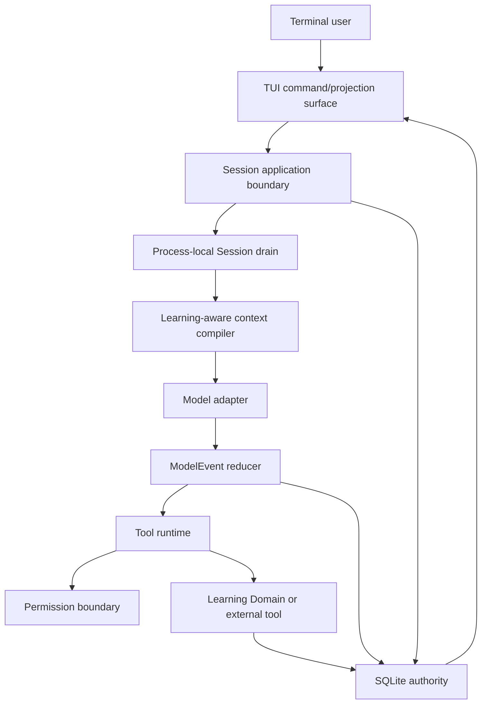

# Foundation runtime contracts

Date: 2026-07-10

Status: Draft for maintainer review; internal coherence audit completed. This
proposal is not an ADR and does not authorize production implementation.

## Purpose

Define the smallest runtime boundary that can support a terminal-native agent
while making learning state part of the ordinary control loop:

```text
learning situation
-> selected action
-> learning activity
-> accepted occurrence
-> revised learner projection
-> changed next action
```

The proposal consolidates the completed foundation research:

- [Message and model-event contract findings](../research/message-and-model-event-contracts.md)
- [Tool lifecycle contract findings](../research/tool-lifecycle-contracts.md)
- [Session serialization and recovery findings](../research/session-serialization-and-recovery.md)
- [Permission flow contract findings](../research/permission-flow-contracts.md)
- [Learning-semantic anchor findings](../research/learning-semantic-anchor.md)
- [Validation and storage findings](../research/validation-and-state-storage.md)

## Semantic checksum

Product-loop purpose:

```text
preserve enough trustworthy history for the Tutor's next action to depend on
what the learner actually did, not only on the current chat message
```

Owned durable facts and invariants:

```text
Session owns ordered interaction and execution history
Learning Domain owns accepted learning occurrences and current obligations
learner projections and compiled context are rebuildable and source-linked
only one process-owned drain executes one Session at a time
a recorded tool invocation settles exactly once
```

Representative behavior:

```text
the learner says “开始学习”
-> current learning context selects an activity
-> an answer produces an accepted occurrence
-> the next model attempt sees a revised projection
-> the Tutor changes its next action
```

Prohibited behavior:

```text
assistant text says “mastered”
or a learning tool merely attempts or fails a write
-> learner state changes
```

Failure and correction behavior:

```text
input retry is idempotent
tool retry cannot duplicate an effect
ambiguous post-crash effects are reconciled, not replayed
projections can be rebuilt
routine learning records are inspectable and correctable without modal friction
```

## Boundary map



Learning semantics enter at context compilation, tool vocabulary, domain
transactions, continuation, and validation fixtures. Provider decoding and TUI
rendering remain domain-independent.

## Ownership

| Boundary | Owns | Does not own |
|---|---|---|
| Model adapter | Provider request/response translation and `ModelEvent` normalization | Session truth, permissions, learning evidence |
| Session application | Input admission, ordered messages, attempts, tool/permission links | Learner inference or provider SDK objects |
| Session drain | One serialized continuation loop and cancellation scope | Durable work truth or domain semantics |
| Context compiler | Provider-ready context plus source/projection provenance | Learning facts or provider streaming |
| Tool runtime | Definition materialization, input/output validation, invocation lifecycle | Permission policy or meaning of learning evidence |
| Permission boundary | Whether a protected effect may occur | Whether the effect succeeded or proves learning |
| Learning Domain | Accepted occurrences, operation receipts, current goals/obligations, projection rules | Session transcript and provider state |
| TUI | Commands, live deltas, and durable projections | Authorization enforcement or persistence authority |
| SQLite | Current structured state, append-mostly facts/audit, recovery anchors | Presentation and model reasoning |

## Identity and ordering

The production types should use distinct branded string IDs. Their exact
encoding is an implementation detail.

```ts
type SessionID = string
type InputID = string
type MessageID = string
type MessagePartID = string
type ModelAttemptID = string
type RuntimeInvocationID = string
type ProviderCallID = string
type PermissionRequestID = string
type ContextSnapshotID = string
type LearningOccurrenceID = string
type EffectReceiptID = string

type RuntimeSchema<T> = {
  parse(input: unknown): T
}

type ModelUsage = {
  inputTokens: number
  outputTokens: number
  reasoningTokens?: number
  cachedInputTokens?: number
}

type ModelFailure = {
  message: string
  code?: string
  retryable: boolean
}

type ModelToolResult = {
  text: string
}
```

Important identity rules:

1. `ProviderCallID` is stable only inside one provider attempt and may repeat
   across attempts.
2. `RuntimeInvocationID` is globally unique in the local database and is the
   idempotency identity used by tools and domain receipts.
3. Every durable Session mutation receives a monotonic `sessionSeq`; timestamps
   do not define order.
4. Client-supplied `InputID` supports exact retry. Reuse with different content
   is a conflict.

## Session input

```ts
type SessionInput = {
  id: InputID
  sessionID: SessionID
  text: string
  admittedSeq: number
  visibleSeq?: number
  admittedAt: number
}
```

Legal transition:

```text
absent -> admitted -> visible
```

There is no reverse transition. Admission is durable before any wake. Making an
input visible and appending its user message occur in one SQLite transaction.

The initial product has one delivery policy. Inputs admitted during an active
model attempt become visible at the next safe provider boundary. Deferred queue
semantics are not included.

## Message and MessagePart

Session messages are application projections, not provider messages and not
learning records.

```ts
type Message = UserMessage | AssistantMessage

type UserMessage = {
  id: MessageID
  sessionID: SessionID
  sessionSeq: number
  kind: "user"
  inputID: InputID
  text: string
  createdAt: number
}

type AssistantMessage = {
  id: MessageID
  sessionID: SessionID
  sessionSeq: number
  kind: "assistant"
  attemptID: ModelAttemptID
  parts: readonly MessagePart[]
  createdAt: number
}

type MessagePart = TextPart | ToolPart

type TextPart = {
  id: MessagePartID
  kind: "text"
  text: string
  completion: "complete" | "interrupted"
}

type ToolPart = {
  id: MessagePartID
  kind: "tool"
  invocationID: RuntimeInvocationID
}
```

Initial deliberate omissions:

- no durable hidden-reasoning part;
- no generic system message in user-visible history;
- no attachment part until the first real attachment flow is designed;
- no duplicate tool state inside the part; it references the invocation
  projection;
- no token-delta rows.

Live text exists in an in-memory projection while streaming. Controlled
interruption closes accumulated text as `interrupted`. A hard process loss may
lose only the uncommitted live tail; the attempt is durably recovered as
interrupted. Coalesced partial checkpoints may be added if observed loss makes
that trade-off unacceptable.

## ModelAttempt

One attempt corresponds to one provider request.

```ts
type ModelAttemptStatus =
  | "dispatching"
  | "streaming"
  | "completed"
  | "failed"
  | "interrupted"

type ModelAttempt = {
  id: ModelAttemptID
  sessionID: SessionID
  assistantMessageID: MessageID
  contextSnapshotID: ContextSnapshotID
  provider: string
  model: string
  status: ModelAttemptStatus
  startedSeq: number
  settledSeq?: number
  finishReason?: string
  usage?: ModelUsage
  error?: ModelFailure
  startedAt: number
  completedAt?: number
}
```

Legal transitions:

```text
dispatching -> streaming -> completed
dispatching -> failed | interrupted
streaming -> failed | interrupted
terminal -> no transition
```

`dispatching` commits before the provider network call. A crash in that gap is
ambiguous provider work and recovers as interrupted; it is not silently
redispatched.

## Provider-neutral ModelEvent

The model adapter emits events for one attempt only:

```ts
type ModelEvent =
  | { type: "text.started"; blockID: string }
  | { type: "text.delta"; blockID: string; delta: string }
  | { type: "text.ended"; blockID: string; text: string }
  | { type: "tool_input.started"; providerCallID: ProviderCallID; name: string }
  | { type: "tool_input.delta"; providerCallID: ProviderCallID; name: string; delta: string }
  | { type: "tool_input.ended"; providerCallID: ProviderCallID; name: string; raw: string }
  | {
      type: "tool.called"
      providerCallID: ProviderCallID
      name: string
      input: unknown
      executionOwner: "runtime" | "provider"
      providerMetadata?: unknown
    }
  | {
      type: "provider_tool.succeeded"
      providerCallID: ProviderCallID
      name: string
      result: unknown
      providerMetadata?: unknown
    }
  | {
      type: "provider_tool.failed"
      providerCallID: ProviderCallID
      name: string
      error: ModelFailure
      providerMetadata?: unknown
    }
  | { type: "response.completed"; finishReason: string; usage: ModelUsage }
  | { type: "response.failed"; error: ModelFailure }
```

Initial invariants:

1. A block starts once, accepts deltas only while active, and ends once.
2. A tool name cannot change for one provider call identity.
3. A complete `tool.called` follows complete input assembly and occurs once.
4. A provider-hosted call settles once through a provider-tool event.
5. Exactly one response terminal event occurs.
6. Deltas are live-only; ended values drive durable Session content.
7. Provider metadata is opaque and cannot control downstream domain branches.
8. Provider response completion does not mean the Session drain or local tools
   have completed.

Provider step events are omitted until a supported provider requires them for
correctness. Hidden reasoning or encrypted continuation data, if required, is
stored as provider-specific attempt continuation data and is never learning
evidence.

## ToolDefinition and per-attempt materialization

The stable tool value owns one input schema, one output schema, one executor,
and one model-output conversion.

```ts
type ToolDefinition<Input, Output> = {
  name: string
  description: string
  revision: string
  inputSchema: RuntimeSchema<Input>
  outputSchema: RuntimeSchema<Output>
  execute(input: Input, context: ToolExecutionContext): Promise<Output>
  toModelResult(output: Output): ModelToolResult
}

type ToolExecutionContext = {
  sessionID: SessionID
  assistantMessageID: MessageID
  attemptID: ModelAttemptID
  invocationID: RuntimeInvocationID
  signal: AbortSignal
  authorize(request: ToolAuthorization): Promise<void>
}
```

This is a semantic shape, not a commitment to a particular schema library or
Promise-based internal implementation.

At attempt assembly, the tool runtime materializes the exact visible
definitions and revisions. A later same-name registration change makes the old
call stale; it never invokes the new handler.

Tools resolve canonical resources, authorize, then perform protected effects.
The registry does not infer authorization from tool visibility.

## ToolInvocation and settlement

Incremental tool input is a live reducer buffer keyed by provider call ID. It
does not acquire a runtime invocation ID. Only a complete provider call creates
and durably records a `ToolInvocation`.

```ts
type ToolPhase = "recorded" | "executing" | "settled"

type ToolInvocation = {
  id: RuntimeInvocationID
  sessionID: SessionID
  attemptID: ModelAttemptID
  assistantMessageID: MessageID
  providerCallID: ProviderCallID
  toolName: string
  definitionRevision: string
  executionOwner: "runtime" | "provider"
  phase: ToolPhase
  recordedSeq: number
  executingSeq?: number
  settledSeq?: number
  rawInput?: string
  input?: unknown
  settlement?: ToolSettlement
  createdAt: number
  settledAt?: number
}

type ToolSettlement =
  | {
      outcome: "success"
      structured: unknown
      modelResult: ModelToolResult
      effectReceiptID?: EffectReceiptID
    }
  | {
      outcome: "rejected"
      reason: "invalid_input" | "unknown_tool" | "stale_definition" | "policy_denied"
      message: string
    }
  | { outcome: "declined"; requestID: PermissionRequestID; feedback?: string }
  | {
      outcome: "failed"
      stage: "execution" | "output_validation" | "result_retention"
      message: string
      effect: { status: "none" } | { status: "committed"; receiptID: EffectReceiptID }
    }
  | { outcome: "cancelled"; message: string; effect: { status: "none" } }
  | { outcome: "indeterminate"; message: string }
```

Legal transitions:

```text
live tool-input buffer -> recorded invocation
incomplete live buffer -> discarded on interruption; never executed
recorded -> executing
recorded -> settled(rejected | cancelled)
executing -> settled(any outcome)
settled -> no transition
```

Semantics of terminal outcomes:

- `failed` and `cancelled` are used only when the runtime knows no authoritative
  effect remains unaccounted for. A failed call may cite a committed receipt;
  otherwise it explicitly states that no effect occurred.
- possible or partially observed side effects produce `indeterminate` until
  reconciliation.
- a domain effect receipt turns a recovered invocation into `success` without
  replaying it.
- a recorded invocation settles exactly once; exact duplicate terminal input is
  idempotent, conflicting settlement is a defect.

The initial runtime executes runtime-owned calls serially in provider order.
Parallel read-only calls are deferred until observed latency justifies a
conflict and backpressure policy.

Provider-hosted calls cannot mutate Repa learning state, local files, review
schedules, or other authoritative local facts.

## PermissionRequest and PermissionDecision

```ts
type PermissionRequest = {
  id: PermissionRequestID
  sessionID: SessionID
  invocationID: RuntimeInvocationID
  action: string
  canonicalResources: readonly string[]
  rememberableScopes: readonly string[]
  explanation: Record<string, unknown>
  policyRevision: string
  status: "pending" | "decided" | "cancelled" | "invalidated"
  createdSeq: number
  terminalSeq?: number
  createdAt: number
}

type PermissionDecision = {
  requestID: PermissionRequestID
  sessionSeq: number
  decidedAt: number
} & (
  | { outcome: "allow_once" }
  | { outcome: "allow_scope"; rememberedScope: string }
  | { outcome: "deny"; feedback?: string }
)
```

Rules:

1. Trusted tool code supplies canonical action/resources.
2. Hard policy deny wins over remembered allow.
3. Missing policy cannot widen authority.
4. Permission is checked inside execution before the protected effect.
5. Pending requests are durable and linked blockers, not tool phases.
6. Exact duplicate decisions are idempotent; conflicting decisions are rejected.
7. Target and policy are revalidated before an allow is consumed.
8. Learner denial settles the invocation as declined and stops the current
   continuation. Optional feedback becomes admitted user steering.
9. Routine local learning occurrences are policy-allowed by default when they
   are provenance-preserving, inspectable, and correctable.

Initial rule syntax can be exact action plus canonical resource prefix. A
general wildcard language is deferred.

## ContextSnapshot

Every model attempt captures what the Tutor was allowed to know at dispatch.

```ts
type ContextSnapshot = {
  id: ContextSnapshotID
  sessionID: SessionID
  sessionThroughSeq: number
  learnerProjectionRevision: string
  sourceOccurrenceIDs: readonly LearningOccurrenceID[]
  activeGoalRevisions: readonly string[]
  obligationRevisions: readonly string[]
  courseSourceRevisions: readonly string[]
  modePolicyRevision: string
  compilerVersion: string
  createdSeq: number
  createdAt: number
}
```

The first schema may normalize source references into a child table rather than
JSON arrays. The invariant is source-linked provenance, not this storage shape.

The provider prompt is rebuildable and provider-specific. It is not the source
of truth. Retrieved documents remain untrusted content; only the context
compiler can construct privileged instructions.

## Minimum learning-domain contract

The foundation does not accept a complete `Topic`, `Claim`, or curriculum
schema. It needs only these roles:

```ts
type LearningOccurrenceReceipt = {
  occurrenceID: LearningOccurrenceID
  operationID: RuntimeInvocationID
  committedAt: number
}

type LearnerProjectionRef = {
  revision: string
  sourceOccurrenceIDs: readonly LearningOccurrenceID[]
  compilerVersion: string
}
```

A learning tool transaction:

1. validates the proposed occurrence and provenance;
2. uses `RuntimeInvocationID` as an idempotency operation key;
3. commits the occurrence, any current structured state change, and an effect
   receipt atomically;
4. returns the receipt;
5. lets learner projections rebuild from committed facts.

Session text, model reasoning, permission approval, and tool success do not by
themselves define the occurrence's educational meaning.

## Modes are policy profiles

One agent loop receives a mode policy that affects four consumers:

```ts
type ModePolicy = {
  contextPolicyRevision: string
  visibleToolNames: readonly string[]
  permissionRulesRevision: string
  continuationPolicyRevision: string
}
```

The exact policies remain data/configuration, not separate runtimes. Plan mode
can omit mutation tools and still enforce a hard execution deny. Review mode
can change default Tutor action and context without acquiring a second loop.

## Process-local Session execution

The coordinator interface is behaviorally:

```ts
type SessionExecution = {
  activeSessions(): ReadonlySet<SessionID>
  resume(sessionID: SessionID): Promise<void>
  wake(sessionID: SessionID): void
  interrupt(sessionID: SessionID): Promise<void>
}
```

Process states:

```text
idle
active
stopping
```

Invariants:

- one active owner per Session;
- concurrent resumes join;
- wake is advisory and coalesces to one successor;
- a joined waiter's cancellation does not cancel the owner;
- explicit interrupt cancels the owner and waits for cleanup;
- input arriving during cleanup remains durable and may start one successor;
- current-process active state is not persisted as authority.

This does not require a durable `AgentRun` row. `ModelAttempt` and
`ToolInvocation` are the durable execution boundaries.

## Session drain algorithm

```text
1. acquire process-local Session ownership
2. classify/reconcile nonterminal prior attempts, invocations, and permissions
3. atomically make eligible admitted input visible
4. stop if no durable work or continuation exists
5. capture Session sequence and learning ContextSnapshot
6. create ModelAttempt(dispatching)
7. dispatch one provider request and reduce ModelEvents
8. record every complete tool call before any local effect
9. authorize and execute runtime-owned tools serially
10. settle or reconcile every invocation
11. close ModelAttempt and partial content
12. re-query Session and Learning Domain state
13. continue only for durable tool results, newly admitted input, or explicit policy
14. release ownership after cleanup
```

Provider `response.completed` does not itself decide step 13.

## SQLite authority and conceptual tables

One local SQLite database is the machine-state authority. The names below are
conceptual; migration design may adjust them.

### Session-owned current and audit records

```text
sessions
session_inputs
messages
message_parts
model_attempts
tool_invocations
permission_requests
permission_decisions
context_snapshots
context_snapshot_sources
```

Required constraints include:

- unique input ID and exact retry payload;
- unique `(session_id, session_seq)`;
- unique runtime invocation ID;
- at most one terminal tool settlement;
- at most one permission decision per request;
- one context snapshot per model attempt;
- provider call ID uniqueness only within one attempt.

### Learning-domain records

```text
append-mostly learning occurrences and corrections
current structured goals and obligations
domain operation receipts keyed by runtime invocation ID
rebuildable learner projections with source references
```

Markdown, generated reports, and JSONL exports are views, not additional
authorities.

## Transaction boundaries

| Transaction | Must commit atomically |
|---|---|
| Input admission | Exact input payload, admitted sequence, retry identity |
| Input visibility | Input visible sequence plus user message |
| Attempt dispatch intent | Context snapshot, assistant message, and `ModelAttempt(dispatching)` |
| Closed content | Full text part plus Session sequence/projection update |
| Tool recording | Immutable invocation identity, definition revision, parsed/raw input boundary |
| Permission request | Pending request plus link to invocation |
| Permission decision | Terminal request state, decision, optional remembered grant audit |
| Learning command | Occurrence/current-state changes plus effect receipt |
| Tool settlement | Terminal invocation outcome plus optional receipt link |

The learning command and Session tool settlement are separate transactions.
Their crash gap is reconciled through the unique effect receipt. A broad
cross-domain transaction API is not introduced.

## Recovery matrix

| Durable state after restart | Recovery |
|---|---|
| Admitted input not visible | Eligible for explicit resume; no input is lost |
| Visible input, no dispatch intent | Safe to create an attempt |
| Dispatching/streaming attempt without terminal status | Close interrupted; do not auto-redispatch |
| Live-only text tail | Tail may be lost; durable closed content remains |
| Incomplete live tool-input buffer | Discard on recovery; no invocation existed and nothing executes |
| Tool recorded, not executing | Execute only if explicitly resumed and definition revision remains valid |
| Tool executing, no settlement | Reconcile receipt; otherwise cancelled or indeterminate, never blind replay |
| Pending permission | Rehydrate request; revalidate target/policy before decision is consumed |
| Decision committed, process died | Same invocation consumes exact decision after revalidation |
| Tool settled, continuation missing | Safe to start a new attempt from durable history |
| Terminal attempt, no pending work | Idle |

Initial startup defaults:

- show pending input, permission, and indeterminate operations;
- do not automatically redispatch an ambiguous provider attempt;
- do not automatically replay any invocation;
- ordinary explicit resume drains safe pending work after reconciliation.

## Learning-native end-to-end trace

1. `开始学习` is admitted before wake.
2. The Session drain makes it visible and captures current learner projection
   revision `L` with source occurrence IDs.
3. The model selects a learning activity and proposes a runtime-owned learning
   tool.
4. The invocation is recorded before execution.
5. Routine local policy allows it; the Learning Domain commits occurrence `O`
   and receipt `R` under the runtime invocation ID.
6. The invocation settles successfully with `R`.
7. The learner projection rebuilds to `L+1` from accepted occurrences.
8. The next model attempt captures `L+1`; it does not reuse context `L`.
9. Different committed evidence can therefore change the next Tutor action.

Counterexamples:

- Assistant text claims mastery: Session changes, Learning Domain does not.
- Learning tool fails validation: invocation settles rejected, no occurrence.
- User declines an external effect: invocation settles declined, correction
  becomes user steering, no equivalent bypass call is attempted automatically.
- Process crashes after occurrence commit but before tool success: receipt `R`
  reconciles the invocation without inserting `O` twice.
- Model repeats a provider call ID in a later attempt: the new runtime
  invocation does not collide with the old one.
- Learner ignores a review panel: routine authorized recording remains valid,
  while inference remains source-linked and correctable.

## Required contract tests before production expansion

### Model reducer

- interleaved text blocks preserve identity;
- delta before start, duplicate start/end, name change, and duplicate terminal
  response are rejected;
- controlled interruption closes accumulated text;
- provider call IDs scope to attempts.

### Session input and execution

- exact input retry is idempotent; conflicting retry fails;
- visibility and user-message append are atomic;
- concurrent resumes dispatch once;
- wakes coalesce and lost wakes do not lose input;
- explicit interrupt waits for cleanup;
- different Sessions may run concurrently.

### Tool lifecycle

- invocation record precedes executor entry;
- stale definition never invokes replacement handler;
- invalid input never executes;
- terminal settlement occurs exactly once;
- interruption reconciles an effect receipt before deciding outcome;
- provider-hosted mutation cannot reach authoritative local state.

### Permission

- hard deny overrides remembered allow;
- renderer cannot bypass execution-layer authorization;
- pending request survives renderer restart;
- duplicate exact decision is idempotent;
- target change invalidates a grant;
- learner decline stops continuation and preserves feedback as steering.

### Learning anchor

- Session assertion and failed tool are not evidence;
- accepted occurrence is idempotent by runtime invocation;
- projection rebuild is equivalent;
- context contains source/revision provenance;
- different committed evidence changes the next action.

## Explicitly deferred

- full TUI implementation;
- HTTP server, worker, SDK, or remote execution;
- multi-agent and subagent orchestration;
- MCP and plugin tool registration;
- broad provider compatibility;
- compaction and long-context policy;
- durable `AgentRun` aggregate;
- deferred input queue modes;
- parallel tool execution;
- wildcard permission language;
- provider-hosted local mutation;
- hidden-reasoning persistence as product data;
- full curriculum, claim, task-family, or mastery schema;
- Anki, Obsidian, PDF, and shell integration;
- mandatory blocking StateDiff approval;
- cloud sync or multi-process ownership.

## Review defaults

Unless maintainer review changes them, the first implementation plan will
assume:

1. one provider and one single-process terminal runtime;
2. explicit resume after ambiguous crash state;
3. serial runtime-owned tools;
4. no provider-hosted mutation;
5. routine provenance-preserving learning writes are non-modal;
6. SQLite is the only machine-state authority;
7. no complete learner ontology before the first accepted occurrence contract;
8. production implementation begins with contract tests, not a TUI scaffold.

## Internal coherence audit

The draft has been checked against the repository's global coherence questions.

1. **Product loop:** every runtime boundary either preserves the learning
   situation/activity/evidence/state/action loop or remains a domain-independent
   transport mechanism.
2. **Durable ownership:** Session facts, learning occurrences, current
   structured state, effect receipts, and rebuildable projections have distinct
   owners.
3. **Duplicate concepts:** provider call identity, runtime invocation identity,
   permission request identity, and learning occurrence identity are related by
   references rather than collapsed or duplicated as competing authorities.
4. **Learning-native behavior:** learner projection revisions and source
   occurrences participate in every model-attempt context boundary; learning is
   not an optional tool added after a generic harness is complete.
5. **Reference discipline:** OpenCode mechanisms are retained only where Repa
   has the same serialization, streaming, permission, or recovery problem. Its
   V1/V2 migration, worker/server split, broad registry overlays, coding tools,
   and event framework are omitted.
6. **Failure behavior:** no path infers that an effect did not occur merely from
   a provider failure, tool error string, interruption, or process loss.
7. **Scope control:** the proposal does not create a TUI, provider fleet,
   curriculum ontology, integration layer, multi-agent framework, or disposable
   product MVP.

The material choices still awaiting maintainer review are the contract shapes
and the defaults listed above, not additional open-ended product discovery.

## Approval consequence

If this proposal is accepted, the next work is not to generate the repository.
It is to split the accepted decisions into small ADRs and implement the first
contract tests in dependency order:

```text
IDs and SQLite transaction helpers
-> Session input admission/visibility
-> process-local Session coordinator
-> ModelEvent reducer and ModelAttempt projection
-> tool invocation lifecycle
-> permission request/decision
-> production form of the learning-semantic anchor
```

Any rejected section is revised here before its types enter production code.
