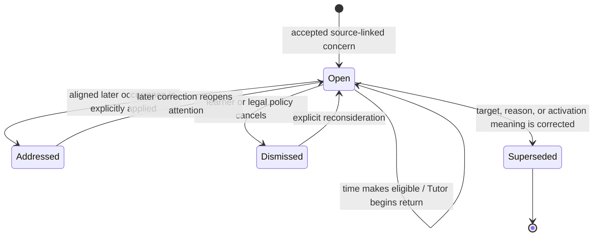

# Teach, adapt, and return architecture proof

Date: 2026-07-12

Status: Completed deterministic architecture-pressure result. This record
promotes only the meaning and authority invariants in the decision section. It
does not freeze a production schema, prescribe a teaching algorithm, or claim
that a human learned.

## Decision question

Course and material continuity now let the Tutor recover the right route and
source in a fresh Session. Earlier labs also proved that a revisit can be
stored, become due, survive restart, and lead a model to lazily retrieve its
source.

Is that enough for the product behavior below?

```text
teach from real material
-> adapt when the learner's response calls for a different move
-> preserve a reason to return only when later attention is useful
-> return in a form that serves that reason
-> keep what happened, what the activity served, and what it evidenced separate
```

The narrower architecture question is whether a generic revisit containing a
target, source, due time, and `completed` state has enough meaning, or whether
Agenda needs a more specific boundary.

## What “proof” means here

This is a distinguishability and counterexample proof, not a mathematical proof
of all future learning behavior.

A candidate boundary passes when it can represent the required behaviors while
keeping existing authorities separate. It fails when two situations collapse
to the same stored/current view but require different observable Tutor actions,
or when one transition would make an unsupported learning claim.

The proof can establish:

- which authority must preserve a future-attention meaning;
- which distinctions are required before production implementation;
- which tempting generic rules produce false positives or false negatives; and
- which existing mechanical results can be reused.

It cannot establish:

- the educational quality of a generated explanation;
- long-term retention or transfer;
- a universally optimal review form or interval; or
- model policy reliability outside the bounded traces.

## Existing evidence and the remaining gap

| Boundary | Existing evidence | What remains unproved |
| --- | --- | --- |
| Course/material continuity | Production can create or load one Course View, preserve route position, bind exact material revisions, lazily read ranges, correct alignment, and continue in a fresh Session. | No Agenda or learning-evidence behavior was exercised. |
| B1 revisit mechanics | The isolated lab schedules, derives due state from time, resolves/cancels, reopens, reschedules, binds sources, settles atomically, and survives restart. An attempt does not automatically create a revisit. | The lab's section/label/due/source record does not say what later activity serves the reason. |
| B2 delayed return | With only `continue` in a new Session, the Tutor sees one compact due revisit, selects it before new material, lazily reads the old attempt, and does not complete it merely by asking a question. | The prompt preselects active recall for one known case; it does not prove purpose-sensitive form selection. |
| Model write initiative | ALS-017 showed that a model can create a real source-bound revisit while runtime and domain code retain authority. B1 separately demonstrated inspectable close, reopen, and reschedule mechanics for its historical revisit shape. | Legal write authority and generic lifecycle mechanics do not establish good creation, alignment, or continuation policy. |
| Source revision | An observed source item preserves historical bytes and reports origin drift; a missing backing item fails closed. Production material reads separately reject stale selectors. | A revisit still needs an explicit policy for target/source realignment. |

Sources:

- [`phase-1-course-continuity-verification-2026-07-12.md`](./phase-1-course-continuity-verification-2026-07-12.md)
- [`learning-native-capability-b1-2026-07-11.md`](./learning-native-capability-b1-2026-07-11.md)
- [`learning-native-b2-trace-6-2026-07-11.md`](./learning-native-b2-trace-6-2026-07-11.md)
- [`model-initiated-learning-writes-2026-07-11.md`](./model-initiated-learning-writes-2026-07-11.md)
- [`source-reference-revision-2026-07-11.md`](./source-reference-revision-2026-07-11.md)

In plain language: the repository has proved that the alarm can be saved, go
off on time, survive a restart, and bring back the old source. It has not proved
what the alarm means or what honestly counts as handling it.

## Controlled product pressure

The controlled examples use one course neighborhood—JavaScript object identity,
aliasing, and copying—so different actions cannot be explained away by different
subjects. The fixture topic is illustrative; the required behavioral
distinctions are not JavaScript types.

### Trace A: acquire a procedure

Situation: a novice does not yet know how to trace assignments and mutations.

Tutor behavior:

1. orient to the relevant material range;
2. demonstrate one worked trace before requiring unsupported problem solving;
3. let the learner follow the trace if useful; and
4. if the learner loses the object identities, replace the prose sequence with
   a concrete store/reference diagram.

Durable consequence:

- the demonstration or followed operation may remain simple progress if a
  later continuation consumes it;
- merely watching does not become independent-performance evidence; and
- no revisit is required when the course can naturally continue and no future
  concern or commitment exists.

Counterexample: a fixed “explain, then quiz” pipeline rejects the valid worked-
example entry and turns an optional later check into mandatory state.

### Trace B: repair a concept or representation

Situation: the learner can mechanically predict simple assignments but still
believes `b = a` creates another object. A first prose explanation does not
help.

Tutor behavior:

1. acknowledge the visible mismatch;
2. materially change representation, for example to a memory diagram;
3. avoid assigning a permanent learner type or stored difficulty category; and
4. continue immediately if the new representation is enough for the learner's
   current goal.

Durable consequence:

- the complete zero-write case leaves only Session history;
- if a future return is genuinely wanted, Agenda may preserve the bounded
  reason “repair the causal model after the earlier explanation failed,” linked
  to the interaction; and
- later providing that representation can serve the Agenda concern without
  becoming evidence that the learner understands.

Counterexample: a resolver that accepts only learner or tool output cannot
handle this valid explanation-purpose return. A resolver that marks the learner
as understanding after the explanation overclaims evidence.

### Trace C: discriminate between strategies

Situation: the learner understands aliasing and shallow copying separately but
confuses when each model applies.

Tutor behavior:

1. present confusable cases rather than more isolated definitions;
2. ask the learner to choose and justify the applicable model; and
3. use the result for feedback without rewriting the Course View.

Durable consequence:

- a future concern may refer to the original attempt and preserve the bounded
  relationship to discriminate;
- a later activity serves it only if the learner actually has to make that
  distinction under relevant assistance conditions; and
- an ordinary object exercise does not serve it merely because its topic label
  overlaps.

Counterexample: a single course item or universal `LearningObject` target loses
the relation being tested. Building a general concept graph to avoid that loss
would be a larger unsupported response; a bounded source-linked reason is
enough for this trace.

### Trace D: return after delay

Situation: a prior independent aliasing error created a reason for a later
check. Several days later a fresh Session contains only `continue`.

Tutor behavior:

1. receive a compact eligible/due Agenda contribution;
2. consider current learner steering, assignments, and other concerns rather
   than treating due as a command;
3. after selecting the concern, lazily retrieve the linked attempt;
4. begin an independent prediction without revealing the answer; and
5. if retrieval fails, adapt into feedback or relearning rather than repeating
   the same test indefinitely.

Durable consequence:

- opening or asking the first question leaves the concern active;
- an actual independent attempt serves the scheduled check whether its answer
  is correct or incorrect;
- the attempt's conditions and result may separately become learner evidence;
  and
- that evidence may justify another concern, but it does not rewrite the one
  that was already served.

Counterexample: `due` does not mean forgotten, selected, begun, completed, or
mastered. One timestamp cannot own all five meanings.

### Trace E: direct real work under a deadline

Situation: a submission is due soon and the learner explicitly asks for direct
help fixing an aliasing bug.

Tutor behavior:

1. respect the real-work request instead of blocking it with a teaching ritual;
2. give the direct help needed for the deadline;
3. preserve a future concern only when the learner or Tutor has a real,
   inspectable reason to return; and
4. record who authored that concern rather than turning a Tutor suggestion into
   a learner promise.

Durable consequence:

- assignment completion remains assignment state;
- copied or heavily assisted work does not silently satisfy an independent-
  application concern;
- a later aligned activity can explicitly affect both authorities when it
  genuinely serves the revisit and completes work; and
- no future concern is mandatory merely because direct help reduced learning
  opportunity.

Counterexample: a database trigger or topic matcher that closes every revisit
when an assignment completes hides assistance and conflates work completion
with learning.

## Additional boundary falsifiers

The five product traces define the main pressure path. Four extra cases guard
the architecture without expanding the first production scope:

- **Learner refusal or correction:** if the learner rejects a proposed return
  or corrects its reason, a stale model invocation cannot create or reactivate
  the old meaning. Source history remains while current Agenda context changes.
- **Material revision:** a concern grounded in material revision 1 cannot
  silently treat revision 2 as the same target. The old observation remains
  inspectable; realignment, supersession, or cancellation is explicit.
- **Accidental overlap:** a later task mentioning the same topic cannot serve a
  discrimination, independent-recall, or application concern unless the
  activity actually carries the required role and conditions.
- **Multiple courses:** the same informal concept name in two courses does not
  establish cross-course equivalence. The first course-local concern may be
  served by cross-course work only after explicit alignment; this does not earn
  a universal concept graph now.

## Deterministic collision lab

The executable pressure fixture is under
[`../../labs/teach-adapt-return-pressure/`](../../labs/teach-adapt-return-pressure/README.md).
It records scenario oracles, not a production state model.

### Coordinate collision

Three accepted future concerns share the same:

```text
course target
target revision
source attempt
eligible time
```

but preserve different learning purposes:

```text
repair a causal model after an explanation failed
check independent prediction after delay
exercise discrimination among confusable models
```

If `P` projects a concern to only the shared coordinates, then:

```text
P(representation return) = P(independent check) = P(discrimination return)
```

while the later learner roles and valid move families differ. Therefore the
projection is insufficient. This proves the need to preserve a bounded
semantic reason; it does not prove that the reason must be an enum, JSON field,
or standalone row.

The reason also does not prescribe the final form. In the concept-repair case,
both a memory diagram and contrasting concrete cases are valid depending on
later learner steering. ALS-020 proves that the meaning must remain
distinguishable, not that Agenda or a deterministic algorithm can select the
best move. That policy claim remains for the shared-model trace.

### Completion-rule collision

Two tempting universal rules both fail:

1. “Any later occurrence on the same target serves the revisit” closes an
   obvious topic-overlap task that never exercises discrimination.
2. “Any later learner/tool item serves it, but assistant output cannot” accepts
   an unsupported `done` statement and rejects an alternate explanation that
   was the actual promised return.

Even a semantically suitable assistant response is insufficient when it exists
only as a partial provider delta from an interrupted Turn. The source must be a
legal, complete learner-facing occurrence under the interaction authority; the
exact delivery representation does not move into Agenda.

The valid relation depends on the stored reason plus facts owned elsewhere:
the actual later occurrence, target/source revisions, cognitive role,
assistance, and result where relevant. Agenda must reference those authorities,
not absorb them into one large revisit record.

### Action/evidence collision

An alternate explanation can serve a future-attention concern while producing
no learner evidence. An independent attempt can serve another concern and also
produce an observation whose outcome may support an inference. Cancelling a
concern can remove future attention without either event.

Therefore these are three different transitions:

```text
Agenda concern dismissed or cancelled
later activity served the Agenda concern
later activity supplied learning evidence
```

The old B1 word `completed` demonstrated a correctable lifecycle mechanism; it
did not prove that these meanings can be collapsed.

## Candidate boundary comparison

| Candidate | Result | Failure or reason |
| --- | --- | --- |
| Raw Session only | Rejected as the whole boundary | Same-Turn adaptation fits, but fresh-Session selection would require broad transcript search or reinterpretation before knowing what deserves attention. |
| Target/time generic revisit | Rejected | The deterministic coordinate and completion collisions lose the intended move and close unrelated activity. |
| Stored intervention stages or difficulty types | Rejected | They add state to the valid zero-write case, confuse transient Tutor judgment with learner authority, and still do not establish later alignment. |
| Universal future-action record | Rejected | Revisit, assignment, learner steering, and route focus have different owners, authority, and legal resolution semantics. |
| Agenda-owned source-linked future-attention concern | Accepted for the tested boundary | It preserves why later attention matters while Course View, material, Session, learner occurrence/evidence, and policy retain their own facts. |

## Promoted architecture invariants

### Meaning and ownership

An Agenda revisit is a correctable **future-attention concern**. It says that
the system has a source-linked reason to return to a target under some
activation condition. It is not:

- the later review activity;
- evidence that the learner forgot;
- a claim that the learner has a stable difficulty;
- a course-structure relation;
- a learner commitment unless the source actually establishes one; or
- a universal future action shared with assignments and goals.

Agenda owns the concern and its lifecycle. Interaction owns its source
occurrence. Course View and Material Map own revision-bound targets and
alignment. Learner record owns later responses, artifacts, assistance, and
evidence meaning. Tutor composition selects and carries out the current move.

### Creation

A concern may be authored or initiated by the learner, model, or a
deterministic domain consequence. The record preserves the real semantic author
and legal source basis. A model may directly commit a routine reversible
concern through an authorized command; it does not need a hidden second
controller.

A current explicit learner refusal prevents the proposed concern or legally
dismisses the existing one according to its actual state. An old physical tool
call cannot replay around that correction and revive superseded meaning.

No explanation, error, direct-help interaction, or completed assignment creates
a revisit by default. A deterministic consequence required by an accepted rule
is derived by code rather than depending on the model to remember a tool call.

### Eligibility and selection

Trusted time or another accepted trigger can make an existing concern eligible
or due. This is a query result, not a timer-created observation or forced Tutor
action. Current learner steering and real constraints remain able to override,
defer, or cancel it.

Code owns trusted time, trigger evaluation, legal state, and hard constraints.
The model may choose or adapt the review form when no accepted deterministic
rule settles it.

### Beginning, serving, evidence, and dismissal

Beginning a revisit does not settle it.

A later activity serves a concern only through an explicit, inspectable
transition that cites a legal complete occurrence after creation and
establishes target, revision, and purpose alignment. A partial provider delta
or interrupted, uncommitted assistant item is not such an occurrence. Facts
such as learner visibility/delivery, assistance, and result stay with their
owning interaction or learner/activity authority. When the relation crosses
assignment, artifact, or learner-evidence boundaries, one explicit application
operation names each consequence; no implicit topic trigger closes them.

Serving the concern means that the promised future attention occurred. It does
not mean the learner answered correctly, retained the knowledge, or mastered
the target. An unsuccessful independent check can serve the scheduled check
and simultaneously produce evidence that changes the next move.

Cancellation or dismissal is an Agenda decision and does not pretend the
purpose was served. A correction may reopen or supersede meaning with
provenance; it does not erase the source history.

The diagram uses conceptual state names, not final production enum values:



### Identity, revisions, and failure

The first command contract must name a durable causal occurrence and an Agenda-
owned semantic effect address. Physical tool-call identity remains separate.
An exact semantic replay settles without another concern; a different cause is
not deduplicated merely because target and time match. Consolidation, when
useful, is explicit rather than target-based last-write-wins.

Target and source references preserve the revisions actually used. A stale
selector or target fails closed. Realignment, cancellation, or supersession is
explicit; source drift does not silently rewrite the concern or learner state.

Creating, addressing, dismissing, or superseding a local concern and settling
its command receipt follows the accepted atomic, retry, interruption, and
restart rules. Entity/source preconditions are used instead of turning one
global revision into a universal stale-write guard.

### Context contribution

Routine current context includes enough compact meaning to distinguish why an
active concern deserves attention, together with its target, activation/due
projection, state, authorship/basis, and lazy source references as required by
the consumer. It does not include the full old explanation, attempt, material,
or evidence trail.

The exact fields and summary format remain open. The invariant is behavioral:
the Tutor must be able to distinguish the intended action before loading
unrelated old history, and then retrieve the exact supporting detail when the
selected move needs it.

## What must be fixed now and what may wait

### Newly fixed by ALS-020

- Agenda owns the source-linked future-attention concern.
- Review activity, Agenda handling, and learner evidence remain separate.
- The concern preserves enough semantic reason to distinguish the later move.
- Due/eligible does not mean forced, begun, addressed, forgotten, or mastered.
- Addressing requires an actual later occurrence and explicit alignment.
- Cancellation does not masquerade as satisfaction.
- Same-Turn teaching adaptation has a required zero-domain-write path.
- Direct deadline help has a required zero-Agenda-write path when no later
  concern or commitment was actually created.

### Inherited contracts, not re-proved by ALS-020

- Model initiative remains legal under runtime/domain authority.
- Semantic identity, source/target revision, correction, atomicity, retry, and
  fresh-Session context follow the accepted ADRs and earlier executable
  evidence.
- Explicit learner refusal and correction remain legal preconditions for the
  first command; stale physical invocation replay cannot revive superseded
  meaning. ALS-020 carries this obligation forward rather than reimplementing
  ADR-0009/0010 retry and steering mechanics.

### Deliberately deferred

- table, directory, command, and field names;
- exact lifecycle labels and whether correction reopens or creates a successor;
- purpose as bounded text, a small structured value, or another source-linked
  representation;
- timestamp, not-before time, window, event trigger, or conditional activation;
- the complete target reference union and cross-course concept matching;
- general alignment automation and the line between deterministic and
  model-assisted judgments;
- recurring revisits, merging, grouping, partial service, and compression;
- scheduler scoring, FSRS, notifications, or a daemon;
- full activity, evidence, mastery, confidence, or learner-projection schemas;
- prompt wording, TUI rendering, and inspection interaction; and
- the final teaching or review policy.

These details may be chosen reversibly when the first production consumer
reaches them. They must not be generalized into a framework merely because one
fixture needs a local value.

## Independent falsification review

Three read-only audits independently checked existing evidence, adversarial
product cases, and the freeze/defer boundary. Their common findings were:

- the mechanical revisit boundary is already demonstrated and should not be
  rebuilt as another experiment;
- `target + purpose + source + timing + lifecycle` still cannot own the facts
  needed to judge a later activity—the actual activity and its conditions stay
  in other authorities;
- B1 `completed` proves inspectable closure mechanics, not aligned service;
- same-Turn adaptation needs a zero-write negative control;
- direct work, learner refusal, stale sources, accidental topic overlap, and
  multi-course reuse all defeat implicit completion rules; and
- no accepted ADR blocks the source-linked Agenda concern boundary.

The audits did not supply authority for the decision. Their counterexamples
were replayed against the accepted product documents and the deterministic lab.
The final adversarial review also rejected an earlier fixture that repeated a
concrete move inside both the stored reason and its expected result. The fixture
now stores a learning purpose, includes two valid forms for one purpose under
different later learner context, rejects partial assistant deltas, and includes
a direct-work zero-write case. The review therefore changed the proof rather
than merely endorsing it.

## Decision

The broad pressure path remains valid, and one architecture boundary is now
earned:

> Repa may persist a specific, correctable, source-linked Agenda concern for
> future attention. It preserves enough bounded reason to choose and later
> audit a purpose-appropriate return. A later activity, Agenda resolution, and
> learning evidence remain separate meanings connected by explicit operations.

This decision rejects the current B1 table as a production schema while reusing
its lifecycle oracles. It does not authorize an activity table, intervention
aggregate, difficulty taxonomy, universal future-action model, learner
projection, or review scheduler.

The deterministic meaning-and-authority gate is complete. At the close of
ALS-020, the next production gate was to specify and implement one real Agenda
command/query slice against the same five traces, including the zero-write and
false-completion counterexamples. Model behavior could then test whether a
shared Tutor policy actually uses the meaning; human learning claims remain
outside that gate.

## Follow-on status: Roadmap 07 and ALS-021

Roadmap 07 has since implemented that bounded production Agenda slice. It
preserves source-linked purpose across Sessions, keeps cold detail lazy,
supports explicit disposition and correction, and retains zero-write paths.
This closes the implementation gate named above; it does not retroactively make
ALS-020 a model-policy or learning-outcome result.

ALS-021 has now run the remaining shared-policy pressure with fourteen
contrasting conditions over eight blocks. All 112 formal samples completed on
their first selected attempts under `tutor-default-v2`. The predeclared
zero-write mutation gate passed only 91/96, and two required-material
conditions reached only 6/8. Both raw blind reviewers gave the
independent-prediction return 0/8: the durable Agenda reason was visible in a
fresh Session, but the Tutor disclosed the answer and reasoning before offering
the intended unaided opportunity.

The two reviewers disagreed on 518 categorical fields, mostly because their
applicability calibration differed. No adjudicated aggregate or formal verdict
was manufactured after objective gates had already blocked acceptance. This
does not reopen ALS-020's Agenda ownership or lifecycle conclusion. It narrows
the still-open seam: durable purpose survives and is queryable, but merely
rendering it as an eligible descriptive concern does not reliably make it
govern the current teaching move.

The next architecture work must therefore examine an explicit selected
current-purpose or teaching-contract projection between Learning System state
and model realization. It must remain subordinate to current learner intent
and must not become a second runtime, universal action enum, or persisted stage
for every explanation.

The controlling records are
[`shared-tutor-policy-contrasting-traces-protocol-2026-07-12.md`](./shared-tutor-policy-contrasting-traces-protocol-2026-07-12.md)
and
[`shared-tutor-policy-pilot-audit-2026-07-12.md`](./shared-tutor-policy-pilot-audit-2026-07-12.md).
The completed campaign result is
[`shared-tutor-policy-formal-result-2026-07-13.md`](./shared-tutor-policy-formal-result-2026-07-13.md).
